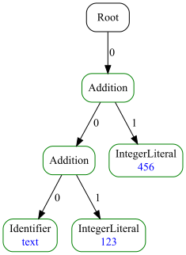

# ASTRANAUT - Abstract Syntax Trees Generator / Converter


[](https://codecov.io/gh/cqfn/astranaut)
[](https://github.com/cqfn/astranaut/blob/master/LICENSE.txt)
___

## 👨‍🚀 Brief

Welcome aboard **Astranaut** — a quirky little Java project with a cosmic name and a singular mission:
to explore, describe, and reshape **syntax trees** (you know, ASTs).

Yes, the name is a pun. It's a mash-up of:
- **AST** — as in _Abstract Syntax Tree_, the skeletal structure of code,
- **transformation** — because we're not just reading trees, we're changing them,
- and **automation** — because doing it all by hand is so last century.

In short, **Astranaut** lets you:
- define and reason about the structure of syntax trees,
- perform pattern-based transformations: find specific nodes (or entire subtrees) and replace them with something 
  smarter, simpler, or just different.

Whether you're building a code linter, refactoring engine, domain-specific transpiler, or just a curious developer
who loves playing with compilers — Astranaut is your friendly toolkit for working with trees like a pro.

## Requirements

* Java 1.8
* Maven 3.6.3+ (to build)

## How to download and build 

You can download the latest release
[here](https://repo.maven.apache.org/maven2/org/cqfn/astranaut).

Fastest way to build the executable is to open the project in Intellij IDEA, select the "Maven" tab
and double-click on the "package" item.

To build using console, go to the folder that contains the project, and type:
```
mvn package
```

In both ways, the executable file named `generator.jar` will be in the `target` folder.

## How It Works

At the heart of Astranaut is a tiny, cozy DSL — a **Domain-Specific Language** for describing the structure of your
syntax trees *and* the rules for transforming them. It’s intentionally simple (because nobody wants to learn
Yet Another Language), but still powerful enough to express real-world transformations.
Or at least, we like to think so.

Astranaut runs in **two distinct modes**, depending on your mood and use case:

### Mode 1: Code Generation

This is the real deal. Astranaut takes your DSL definitions and spits out full-blown Java code:
- 🧱 Classes representing AST nodes.
- 🔁 Transformers that walk and mutate the trees.
- 🛠️ Utility classes to help you wire everything into your Java project with minimal fuss.

Think of it like ANTLR, but focused purely on AST structure and transformation.
If you've ever used tools that generate parser or visitor classes — you're in familiar territory.

### Mode 2: On-the-Fly Interpretation

Too impatient to generate code and compile it? We got you. In interpretation mode, Astranaut:
- loads your DSL definitions,
- parses input (either raw text or a JSON-formatted syntax tree),
- runs the transformation right then and there,
- and gives you back a new JSON tree as output.

Yes, it’s a bit slower than the generated code. But it’s perfect for quick experimentation, debugging,
or just getting a feel for your rules.

Bonus: Astranaut can also draw pretty pictures of your trees — PNG or SVG — which is super handy when you’re trying
to debug a pattern or just admire your beautifully structured code.

## 🌳 Trees, Glorious Trees

At the core of Astranaut lies a clean, minimalistic model for representing syntax trees.
It’s all based around just **three interfaces** — elegant, extensible, and designed with transformation in mind.

Every tree node you’ll ever meet in Astranaut is an implementation of the `Node` interface.
Here’s what you need to know:

### Node — The Backbone of the Forest

Think of this as the universal interface for AST nodes. It’s immutable (on purpose!), thread-safe, and designed to be
friendly for both humans and code generators. With just a few methods to implement, it's easy to extend — but behind
the scenes, it still packs a punch.

Highlights include:
- Access to the node’s **type**, **data**, **properties**, and **children**.
- Methods for **deep comparison**, **cloning**, and even generating string representations.
- A custom `List<Node>` wrapper for children (yay, no more reinventing `.getChild()` loops).
- Utility methods to iterate, stream, and pattern-match your way through the tree.

### Type — What Kind of Node Is This?

Each node has a `Type`, which describes:
- its **name**,
- its **child type constraints** (useful for validation),
- optional **group hierarchy** membership,
- and a handful of helpful **properties**.

It’s like a schema for your tree, but in a form that plays nice with both DSL and Java code.

### Builder — Assemble Your Node

Last but not least, there’s the `Builder` interface. You’ll use this when creating new nodes — whether manually,
or during a transformation. Builders are stateful, chainable, and they validate things for you before you ever
call `createNode()`.

You set:
- the **fragment** (a bit of source code, if you have it),
- the **textual data** (optional),
- the **children** (obviously),
and then, if all is good, voilà — you get a brand-new immutable `Node`.

## JSON Input/Output (Interpreter Mode)

When running in **interpreter mode**, Astranaut doesn’t generate code — instead, it takes a tree (in JSON format),
applies your transformation rules on the fly, and spits out a new JSON tree. It’s perfect for quick prototyping,
testing, and exploring.

Here’s a real-life example of a minimal input tree:

```json
{
  "root": {
    "language": "java",
    "type": "Root",
    "children": [
      {
        "type": "Addition",
        "children": [
          {
            "type": "Addition",
            "children": [
              {
                "type": "Identifier",
                "data": "text"
              },
              {
                "type": "IntegerLiteral",
                "data": "123"
              }
            ]
          },
          {
            "type": "IntegerLiteral",
            "data": "456"
          }
        ]
      }
    ]
  }
}
```

Let’s break it down:
- The tree starts with a Root node — this is your entry point.
- Inside, there's an Addition node with two children:
  - Another nested Addition, combining an identifier ("text") and a number (123).
  - And finally, a second IntegerLiteral with value 456.
This structure might come from parsing an expression like:

```java
text + 123 + 456
```

Oh, and of course, Astranaut’s core library (astranaut-core) comes with full support for reading and writing these
JSON trees. So you can integrate it into your tools, editors, or pipelines effortlessly.

### Where to Find All This

These interfaces (and a bunch of handy utilities) live in the separate Maven module:
[`astranaut-core`](https://github.com/cqfn/astranaut-core) — a lightweight library that provides all the foundational
plumbing for AST modeling and manipulation.

Generated nodes, transformers, and everything your DSL produces will implement these interfaces.
So once you learn this model, you're good to go across the whole platform.

Want to explore the guts? Head to the [core documentation](https://github.com/cqfn/astranaut-core/blob/master/README.md) 
for deep-dives, advanced examples, and a few delightful hacks.

## Command-Line Interface

Astranaut ships with a CLI so you can generate code or run transformations with minimal effort and maximum control.

### Basic Usage

```bash
java -jar generator.jar <action> <path-to-dsl> [options...]
```

Yep, that’s it. Just two required arguments:

1. `<action>` — what you want Astranaut to do (generate, etc.)
2. `<path-to-dsl>` — path to your DSL file (the one that defines the AST structure and transformation rules)

After that, optional flags kick in depending on what you're doing.

### Action: `generate`

This is the bread and butter of Astranaut: turn your DSL into shiny, compile-ready Java code.

```bash
java -jar generator.jar generate my.dsl \
  [--output out/folder] \
  [--license license.txt] \
  [--package com.example.ast] \
  [--version 1.2.3]
```

**Available options:**

| Flag              | Description                                                                                                                                                           |
| ----------------- | --------------------------------------------------------------------------------------------------------------------------------------------------------------------- |
| `--output`, `-o`  | Folder where Java files will be generated. Defaults to `./output`.                                                                                                    |
| `--license`, `-l` | Path to a license (copyright) text file. If provided, its contents will be prepended to all generated files. If not provided, a basic autogenerated one will be used. |
| `--package`, `-p` | Java package name for the generated classes. Default is simply `ast`, but you can (and should!) use something that fits your project.                                 |
| `--version`, `-v` | Version number to embed in the generated classes. Makes version tracking — and passing static analysis — way easier.                                                  |

Why bother with license headers and versioning? Because we’re perfectionists. We want the generated code to pass
every linter, every checker (CodeStyle, PMD, whatever your build throws at it) without needing any exceptions
or suppressions.

Yes, the generated code is clean. Yes, it looks like something you'd proudly write by hand. Yes, you can trust it.
Believe us. Or better yet — try it. 😎

### Action: `transform`

Use this action when you want to apply your DSL-defined transformations directly to a JSON tree.
No codegen, no compilation — just in-place tree magic.

```bash
java -jar generator.jar transform my.dsl \
  --source input.json \
  [--language java] \
  [--ast output.json] \
  [--image tree.svg]
```

**Options:**

| Flag               | Description                                                                                                                                                     |
| ------------------ | --------------------------------------------------------------------------------------------------------------------------------------------------------------- |
| `--source`, `-s`   | Path to the input JSON file (your original syntax tree). **Required.**                                                                                          |
| `--language`, `-l` | Target language name. Defaults to `"common"`. This comes into play if your DSL supports multiple languages (yes, that’s a thing — see "green-red trees" below). |
| `--ast`, `-t`      | Output path for the transformed syntax tree in JSON format. Optional — skip this if you just want to sanity-check your DSL or transformations.                  |
| `--image`, `-i`    | If specified, generates a visual representation of the final tree (after transformation). Just pass the file name, either `.png` or `.svg`, and you’re set.     |

**🎨 Tree Visuals?** Absolutely. Sometimes looking at a transformed AST as JSON is... less than inspiring.
Use --image tree.png or tree.svg to see your result laid out as an actual tree diagram.
It’s great for debugging — and even better for slide decks or documentation.

Here is an image of the tree derived from the JSON example above:



### Action: `parse`

This one’s a bit different — instead of feeding Astranaut a full-blown syntax tree in JSON, you give it plain **text**.
A regular file. Just characters.

Astranaut then:
1. Parses your file **character by character** into a flat "degenerate" AST
   (basically a `Root` node with one child per character).
2. Applies your transformation rules to fold those characters into meaningful nonterminals.
3. Outputs a full, structured AST as JSON — or as an image, if you like pictures.

Here is an example of a degenerated tree before processing:


#### Usage:

```bash
java -jar generator.jar parse my.dsl \
  --source code.txt \
  [--language java] \
  [--ast output.json] \
  [--image tree.png]
```

**Options** (same as `transform`):

| Flag               | Description                                                                                      |
| ------------------ |--------------------------------------------------------------------------------------------------|
| `--source`, `-s`   | A plain-text file to parse. **Required**.                                                        |
| `--language`, `-l` | Target language (from your DSL). Defaults to `"common"`.                                         |
| `--ast`, `-t`      | Output path for the resulting AST in JSON format. Optional.                                      |
| `--image`, `-i`    | Path to an image file (SVG or PNG) that will visualize the final tree. Optional, but super cool. |

This is your go-to action when you want to define your own parser using transformation rules alone.

## Syntax


## Contributors

* Ivan Kniazkov, @kniazkov
* Polina Volkhontseva, @pollyvolk

See our [Contributing policy](CONTRIBUTING.md).