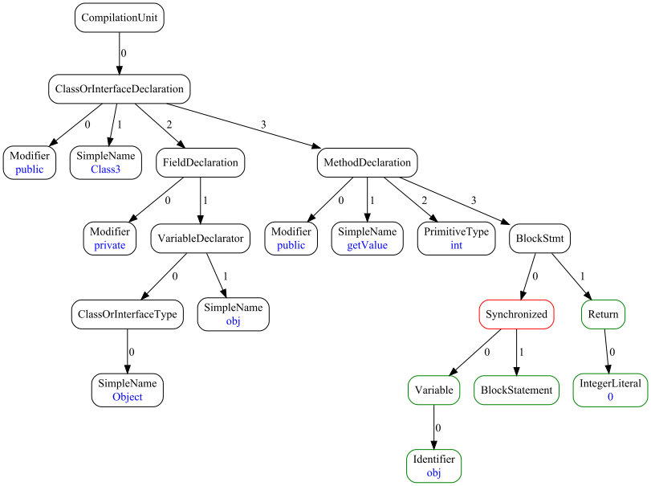

# Abstract Syntax Trees Generator / Converter


[](https://codecov.io/gh/unified-ast/ast-generator)
[](https://github.com/unified-ast/ast-generator/blob/master/LICENSE.txt)
___

## Brief

This software was prepared as part of an investigation of the possibilities of transformation
and unification of syntax trees.

This application is a compiler/interpreter for a domain-specific language ("DSL") that allows
to describe syntax trees and their transformations.

In compiler mode, the application generates source code in the Java programming language,
which describes the structure of a specified syntax tree, methods for subtrees transforming,
as well as auxiliary classes. The generated source code is then used in another project for
predefined syntax tree operations.

In interpreter mode, the application transforms the syntax tree represented in JSON format according
to the specified DSL rules.

## Requirements

* Java 1.8
* Maven 3.6.3+ (to build)

## How to build and download

You can download the latest release
[here](https://github.com/unified-ast/ast-generator/releases).

Fastest way to build the executable is to open the project in Intellij IDEA, select the "Maven" tab
and double-click on the "package" item.

To build using console, go to the folder that contains the project, and type:
```
mvn package
```

In both ways, the executable file named `generator.jar` will be in the `target` folder.

## Syntax tree representation

An abstract syntax tree is a directed graph with the following properties:
* Each node, except the root, has only one predecessor;
* Each node has a type (represented as a string), and optionally has data (also represented as a string);
* The order of the successors is significant.

If the application is used in generator mode, the node types are supplemented with information
about the types of successors that such a node can have. This allows the application to control
semantic integrity in the process of transforming the tree.



These properties of the syntax tree allow us to store the tree in a human-readable format.
We have chosen JSON as such a format. This application reads and writes the following JSON structure:

```
{
    "root" : NODE_DESCRIPTOR
}
```

where `NODE_DESCRIPTOR` is the structure:

```
{
    "type" : "<the type name>",
    "data" : "<the data>",
    "children" : [
        NODE_DESCRIPTOR,
        NODE_DESCRIPTOR...
    ]
}
```

Only the `type` is required. The fields `data` and `children` are optional;
they are not filled in if the node has no data or children.

Here is an example of a valid JSON document:

```
{
    "root" : {
        "type" : "Addition",
        "children": [
            {
                "type": "IntegerLiteral",
                "data": "2"
            },
            {
                "type": "IntegerLiteral",
                "data": "3"
            }
        ]
    }
}
```

The JSON document generated by other applications may also contain additional data
required to process the syntax tree, but this application will ignore such data.

## Command line interface

Here and below, it is assumed that the name of the executable file is `generator.jar`.

### Interpreter mode

In this mode, the application loads from files: the source tree represented in JSON format
as well as the transformation rules described using the DSL syntax, then performs
transformations and saves the resulting tree in JSON format to a new file.

Syntax:

```
java -jar generator.jar --action convert --rules <path to .dsl file> --source <path to sourse .json>
     --destination <destination.json>
```

Required arguments:

* `--action` (short: `-a`), the action, should be `convert`;
* `--rules` (short: `--dsl`, `-r`), the path to a file that contains rules described using the DSL
syntax, expected file extensions are `.dsl` or `.txt`;
* `--source` (short: `--src`, `-s`), the path to a file that contains a syntax tree represented
in JSON format, expected file extension is `.json`;
* `--destination` (short: `--dst`, `-d`), path to the file where the result will be saved, 
file extension is `.json`.

This mode does not take any optional arguments.

Example:

```
java -jar generator.jar -a convert --dsl my_rules.dsl --src source_tree.json --dst result.json
```

### Compiler mode

This mode generates Java source files that represent the structure of the specified syntax tree
and methods for processing it. Such sources must be a part of another project that works with syntax trees.
9 types of files are generated:
* `package-info.java`;
* classes that describe the nodes of the syntax tree with a set of required and optional successors
(so-called "ordinary nodes");
* classes that describe terminal nodes, such as literals;
* classes that describe nodes whose list of successors is limited to sub-nodes of one type (so-called
"list nodes");
* interfaces that combine some nodes that belong to the same parent type, or the so-called "abstract nodes";
* factories that create nodes, with syntactic correctness checking;
* matchers that find subtrees according to some pattern;
* converters that perform one syntax tree transformation as described by DSL rules;
* adapters that perform syntax tree transformation applying all rules in some sequence.

Each line of DSL code produces at least 200 lines of Java code.
Generated code can be checked by static code analyzers such as PMD without any warnings.

Unlike an interpreter, this mode allows you to implement applications that describe a strict
syntax tree structure. Each code transformation is performed with a syntactic correctness check.

Syntax:

```
java -jar generator.jar --action generate --rules <path to .dsl file> [optional arguments]
```

Required arguments:

* `--action` (short: `-a`), the action, should be `generate`;
* `--rules` (short: `--dsl`, `-r`), the path to a file that contains rules described using the DSL
  syntax, expected file extensions are `.dsl` or `.txt`.

Optional arguments:

* `--license` (short: `-l`), the file containing license information. This information will be added
to the beginning of each generated file. The license information is required for the generated code to be 
validated by a code checker without errors. Default value is `LICENSE.txt`;
* `--output` (short: `-o`), output folder where files will be generated. Default value is `./generated`;
* `--package` (short: `-p`), the name of the package that contains the generated classes.
An appropriate directory structure will be built. Default value is `org.uast`;
* `--base` (short: `-b`), the name of the package that contains the base classes and interfaces
that describe the base structure of the syntax tree. Each generated class or interface inherits
from a class or an interface described in this package. In the `generator` project, this package is named
`org.cqfn.astgen.base`
([sources](https://github.com/unified-ast/ast-generator/tree/master/src/main/java/org/uast/astgen/base))
and must be moved to the target project so that the generated classes can be compiled;
* `--version` (short: `-v`), specifies the version of the implementation. This version will be added as 
a `@since` tag to every generated class or interface. Default value is `1.0`;
* `--test` (short: `-t`), without a parameter, test mode. The DSL syntax will be checked, but no files
will be written to the file system.

Example:

```
java -jar generator.jar -a generate --dsl my_rules.dsl -o d:\my_other_project\src\java
     -p com.example.project.ast -b com.example.project.base -l d:\my_other_project\LICENSE.txt
```

## Domain-specific language

### §1. Program structure

A DSL program is a set of rules separated by semicolons `;`.

Each rule consists of a left part, a delimiter and a right part, for example:

```
Addition <- left@Expression, right@Expression;
```
There are two types of delimiters. The rule containing the `<-` delimiter describes the structure
of a syntax tree node. The rule containing the `->` delimiter describes a transformation.

### §2. Green and red nodes

The project was created as part of an investigation related to the unification of syntactic trees.
It therefore included a mechanism to support the so-called "green" and "red" nodes.

The program can be divided into sections. A section marker consists of an identifier
(programming language name), followed by a colon, for example:

```
Addition <- Expression, Expression;

java:

Synchronized <- Expression, BlockStatement;
```

All rules that are described after such a marker refer to the appropriate programming language.

A section that is at the beginning of a program that does not have a marker is called
a common or **green** section. Green section contains description of **green** nodes.

A green node is a node that represents some construction which has a common meaning in all
programming languages under consideration.

Each green node should contain a comprehensive number of children.
It means that such a node may represent all possible varieties of the corresponding language
construction. E.g., the green node `Addition <- Expression, Expression;` matches the addition
construction of all programming languages. This node has the same successors set for Java,
JavaScript, Python, and so on.

Another example, the `Synchronized` construction only occurs in the Java language.
It is in the corresponding section, and therefore it is a **red** node.

The source code generator generates classes and interfaces related to different programming languages
into different packages.

### §3. Description rules

Description rules consist of a type name and a list of child node types, separated by the `<-` delimiter.

These rules describe the structure of the syntax tree. ***These rules work only in generation mode
and are ignored by the interpreter***.

### §4. Successor nodes number
Each AST node should contain a number of successor nodes that satisfies only one of the listed options:

* The number of successors is limited. Successors can be of different types.
* The number of successors is unlimited. All successors must be of the same type.
* No successors.

### §5. "Ordinary" nodes

Describes an "ordinary" node that has a name and possibly some set of successor nodes.

Syntax:
```
Type <- Type, Type, ... ;
```
For example,
```
Addition <- Expression, Expression;
```
What does it mean: "A node of type `Addition` has two successors, each of `Expression` type". 
Such a node can only be created if all the necessary child nodes of the specified type are present,
otherwise the factory will not build this node. This condition applies to all nodes of the tree.
Thus, the main feature of a syntax tree described using DSL rules is achieved - **if a syntax tree 
is built, then it is syntactically correct**.

### §6. Tagged child type names

You can add a tag for a child type. Syntax:
```
Type <- tag@Type, ... ;
```
For example,
```
Addition <- left@Expression, right@Expression;
```
When generating code, for each successor that has a tag, additional methods will be created:
* getter, i.e. method `get...()`, for example `getLeft()`, `getRight()`, to get a child node by its tag,
which can be convenient when writing a parser;
* setter, i.e. method `set...()`, for example `setLeft()`, `setRight()`, to specify a child node separately
when constructing a node.

### §7. Optional child nodes

A set of child nodes can have optional nodes.
The type name of an optional child node is placed in square brackets. Syntax:
```
Type <- [Type], ... ;
```
For example,
```
Return <- [Expression];
```
What does it mean: "A node of type `Return` has no successors, or has one successor of `Expression` type".

Another example:
```
VariableDeclaration <- [type@Identifier], name@Identifier, [init@Expression];
```
What does it mean: "A node of `VariableDeclaration` type has at least one successor of `Identifier` type,
and it may or may not have up to two additional successors: one of `Identifier` type
and one of `Expression` type".

### §8. Nodes without successors

A node that has no successors is described like this:

```
Type <- 0;
```
For example,
```
PublicModifier <- 0;
```

### §9. Literals

This is a special type of node that has data. Node data is stored in its "natural" form
(that is, integers in an `int` variable, strings in a `String` variable, and so on), so you need
to specify methods for parsing and serializing such data.

Native Java code is placed between dollar signs `$`, for example:
```
$Integer.parseInt(#)$
```
Rule syntax:

```
Type <- $type$, $serializer$, $parser$ [, $exception$];
```
Where:

* `type` is a name of native Java type, for example, `$int$`, `$String$`, and so on;
* `serializer` is a Java expression, a piece of code that converts a node's internal variable
to a string. The name of the internal variable is replaced with a hash symbol `#`. Example:
`String.valueOf(#)`;
* `parser` is a Java expression, a piece of code that converts an input string to 
a node's internal variable. The name of the input variable that contains string,
is replaced with a hash symbol `#`. Example: `$Integer.parseInt(#)$`;
* `exception` (optional) is the class name of a Java exception that may be thrown during 
the conversion of a string to an internal type, for example, `$NumberFormatException$`.

Examples:
```
IntegerLiteral <- $int$, $String.valueOf(#)$, $Integer.parseInt(#)$, $NumberFormatException$;
StringLiteral <- $String$, $#$, $#$;
```

### §10. List nodes

A list node is a node, the number of successors of which is unlimited, and all successors
of the same type. Syntax:
```
Type <- {Type};
```
For example,
```
BlockStatement <- {Statement};
```

### §11. Abstract nodes

An abstract node is a node whose type combines several other types.
An abstract node cannot be instantiated directly; however a non-abstract type node can be customized
to an abstract type node.

Syntax:
```
Type <- Type | Type | ... ;
```
For example:
```
Addition <- Expression, Expression;
Subtraction <- Expression, Expression;
IntegerLiteral <- $int$, $String.valueOf(#)$, $Integer.parseInt(#)$, $NumberFormatException$;
Expression <- Addition | Subtraction | IntegerLiteral;
```
What does it mean: "An abstract node of `Expression` type combines nodes of `Addition`, `Subtraction`,
`IntegerLiteral` types. Therefore, the successor of, for example, a node of the `Addition` type
can be a node of `Subtraction` or `IntegerLiteral` type, or another node of `Addition` type".

An abstract node can also combine other abstract nodes. The previous example could be rewritten like this:
```
Addition <- Expression, Expression;
Subtraction <- Expression, Expression;
BinaryOperator <- Addition | Subtraction;
IntegerLiteral <- $int$, $String.valueOf(#)$, $Integer.parseInt(#)$, $NumberFormatException$;
Expression <- BinaryOperator | IntegerLiteral;
```

If an abstract node contains only one non-abstract node, then it is described as follows:
```
Type <- Type | 0;
```

It is possible to combine an abstract node located in a section related to a specific
programming language (red section) with an abstract node with the same name, but located in
the green section. This allows to support a hierarchy of nodes for a specific programming
language. Syntax:
```
Type <- & | Type | ...
```
For example:
```
Addition <- Expression, Expression;
Subtraction <- Expression, Expression;
Expression <- Addition | Subtraction;

c:

AddressOf <- Expression;
Expression <- & | AddressOf;
```
Here, for the C programming language, we added a node that describes "address of" operator.
It inherits from the `Expression` type.

### §12. Transformation rules

Transformation rules consist of two descriptors, separated by the `->` delimiter.
```
Descriptor -> Descriptor;
```
The left descriptor describes the subtree template that is searched for in the tree being transformed.
The right descriptor describes the resulting subtree, which replaces the original subtree
in case of a pattern match.

### §13. Transformation descriptor syntax

The descriptor consists of the type name and optionally a list of parameters and data.

A descriptor with no parameters or data is just a type name:
```
Type
```
For example,
```
PublicModifier
```
Descriptors may contain holes. A hole is a marker that designates a child node or data
to be transferred to the resulting subtree. The hole syntax is a hash sign followed by a positive number:
```
#1
```
The descriptor data is specified in angle brackets after the type name.
The data can be a quoted string or a hole.

Descriptor example that contains data represented as a quoted string:
```
literal<"+">
```
Descriptor example that contains data represented as a hole:
```
literal<#0> 
```
Characters within a string can be escaped, similar to how it is done in the C or Java programming
languages. The `\n` construction means "newline", `\r` - "carriage return", `\t` - "tabulation",
and  `\"` - "quote character".

Descriptor example that contains data represented as a string that contains escaped character:
```
literal<"test\n">
```

The parameter list specifies in parentheses after the type name:
```
Type(Parameter, Parameter, ...)
```
The parameter can be another descriptor or a hole.

An example of a descriptor that contains two holes in the parameter list:
```
Addition(#1, #2)
```
An example of a descriptor that contains another descriptor, as well as holes:
```
singleExpression(#1, literal<"+">, #2)
```
The last (or only) hole inside the parameter list can have an ellipsis:
```
#1...
```
For example,
```
StatementBlock(#1...)
```
Ellipsis means that this hole will transfer this element, as well as all remaining child
elements, regardless of their number. Here are some examples:
```
AAA(#1, #2...) -> ...;
```
...will analyze the node whose first child is different from others, this child will be placed in cell 1,
and the rest in cell 2.
```
AAA(#1...) -> BBB(#1);
```
...will move all children of `AAA` node to `BBB` node.

### §14. Transformation principles

The converter sequentially applies the rules to all nodes of the source tree, starting from the leaves.
Each node is treated as a subtree. If a new subtree is created as a result of applying the rule,
the original subtree is replaced with the new one.

The converter compares the pattern described on the left side of the transformation rule with the subtree,
and if the pattern matches, creates the subtree described on the right side.

Let's consider several types of descriptors and the actions that the converter performs
if the descriptor is on the left and on the right side of the transformation rule.

#### Descriptor without parameters and data

```
Type
```

*Left side*: The converter compares the node type name with the `Type`.
If they match, and the node has no successors and no data, then the pattern is considered a match.

*Right side*: The converter creates a node of the specified type, without successors and data.

#### Descriptor with data represented as a string

```
Type<"...">
```

*Left side*: The converter compares the node type name with the `Type` and the node data
with the specified data. If they match, and the node has no successors, then the pattern is considered
a match.

*Right side*: The converter creates a node of the specified type and data and without successors.

#### Descriptor with data represented as a hole

```
Type<#...>
```

*Left side*: The converter compares the node type name with the `Type`.
If they match, and the node has no successors and no data, then the pattern is considered a match.
The converter extracts the node data and places it in the cell with the specified number.

*Right side*: The converter creates a node of the specified type, with the data extracted from the cell
with the specified number, and without successors.

#### Descriptor with a hole parameter

```
Type(#..., ...)
```

*Left side*: The converter compares the node type name with the `Type`. If they match, and the node
has the same number of successors as the number of parameters, and also the node has no data,
then the pattern is considered a match. The converter extracts the child node and places it in the cell
with the specified number.

*Right side*: The converter creates a node of the specified type, with the successor extracted from
the cell with the specified number, and without data.

#### Descriptor with a descriptor parameter

```
Type(Type...)
```

*Left side*: The converter compares the node type name with the `Type`.
If they match, and the node has the same number of successors as the number of parameters,
and also the node has no data, then the converter extracts the subtree and recursively tries to compare
the sub-descriptor and subtree. If the sub-descriptor matches, the whole pattern is considered a match.

*Right side*: The converter creates a successor node as specified in the sub-descriptor,
then creates a node of the specified type, with this successor and without data.

#### Example

```
singleExpression(#1, literal<"+">, #2) -> Addition(#1, #2);
```
If the name of the node type is `singleExpression`, and the node has three successors, and the name of
the type of the second successor is `literal`, and the second successor has the data represented as `+`
string, then replace this node by another with `Addition` type, which has successors that are first and third
successors of original node.

### Contributors

* Ivan Kniazkov, @kniazkov
* Polina Volkhontseva, @pollyvolk

See our [Contributing policy](CONTRIBUTING.md).