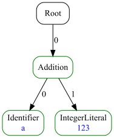
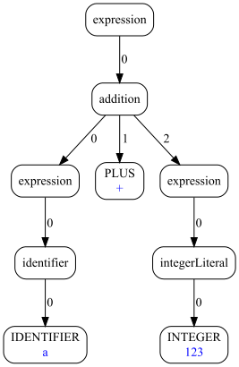

# ASTRANAUT - Abstract Syntax Trees Generator / Converter


[](https://codecov.io/gh/cqfn/astranaut)
[](https://github.com/cqfn/astranaut/blob/master/LICENSE.txt)
___

# 👨‍🚀 Brief

Welcome aboard **Astranaut** — a quirky little Java project with a cosmic name and a singular mission:
to explore, describe, and reshape **syntax trees** (you know, ASTs).

Yes, the name is a pun. It's a mash-up of:
- **AST** — as in _Abstract Syntax Tree_, the skeletal structure of code,
- **transformation** — because we're not just reading trees, we're changing them,
- and **automation** — because doing it all by hand is so last century.

In short, **Astranaut** lets you:
- define and reason about the structure of syntax trees,
- perform pattern-based transformations: find specific nodes (or entire subtrees) and replace them with something 
  smarter, simpler, or just different.

Whether you're building a code linter, refactoring engine, domain-specific transpiler, or just a curious developer
who loves playing with compilers — Astranaut is your friendly toolkit for working with trees like a pro.

# Requirements

* Java 1.8
* Maven 3.6.3+ (to build)

## How to download and build 

You can download the latest release
[here](https://repo.maven.apache.org/maven2/org/cqfn/astranaut).

Fastest way to build the executable is to open the project in Intellij IDEA, select the "Maven" tab
and double-click on the "package" item.

To build using console, go to the folder that contains the project, and type:
```
mvn package
```

In both ways, the executable file named `generator.jar` will be in the `target` folder.

# How It Works

At the heart of Astranaut is a tiny, cozy DSL — a **Domain-Specific Language** for describing the structure of your
syntax trees *and* the rules for transforming them. It’s intentionally simple (because nobody wants to learn
Yet Another Language), but still powerful enough to express real-world transformations.
Or at least, we like to think so.

Astranaut runs in **two distinct modes**, depending on your mood and use case:

## Mode 1: Code Generation

This is the real deal. Astranaut takes your DSL definitions and spits out full-blown Java code:
- 🧱 Classes representing AST nodes.
- 🔁 Transformers that walk and mutate the trees.
- 🛠️ Utility classes to help you wire everything into your Java project with minimal fuss.

Think of it like ANTLR, but focused purely on AST structure and transformation.
If you've ever used tools that generate parser or visitor classes — you're in familiar territory.

## Mode 2: On-the-Fly Interpretation

Too impatient to generate code and compile it? We got you. In interpretation mode, Astranaut:
- loads your DSL definitions,
- parses input (either raw text or a JSON-formatted syntax tree),
- runs the transformation right then and there,
- and gives you back a new JSON tree as output.

Yes, it’s a bit slower than the generated code. But it’s perfect for quick experimentation, debugging,
or just getting a feel for your rules.

Bonus: Astranaut can also draw pretty pictures of your trees — PNG or SVG — which is super handy when you’re trying
to debug a pattern or just admire your beautifully structured code.

# 🌳 Trees, Glorious Trees

At the core of Astranaut lies a clean, minimalistic model for representing syntax trees.
It’s all based around just **three interfaces** — elegant, extensible, and designed with transformation in mind.

Every tree node you’ll ever meet in Astranaut is an implementation of the `Node` interface.
Here’s what you need to know:

## Node — The Backbone of the Forest

Think of this as the universal interface for AST nodes. It’s immutable (on purpose!), thread-safe, and designed to be
friendly for both humans and code generators. With just a few methods to implement, it's easy to extend — but behind
the scenes, it still packs a punch.

Highlights include:
- Access to the node’s **type**, **data**, **properties**, and **children**.
- Methods for **deep comparison**, **cloning**, and even generating string representations.
- A custom `List<Node>` wrapper for children (yay, no more reinventing `.getChild()` loops).
- Utility methods to iterate, stream, and pattern-match your way through the tree.

## Type — What Kind of Node Is This?

Each node has a `Type`, which describes:
- its **name**,
- its **child type constraints** (useful for validation),
- optional **group hierarchy** membership,
- and a handful of helpful **properties**.

It’s like a schema for your tree, but in a form that plays nice with both DSL and Java code.

## Builder — Assemble Your Node

Last but not least, there’s the `Builder` interface. You’ll use this when creating new nodes — whether manually,
or during a transformation. Builders are stateful, chainable, and they validate things for you before you ever
call `createNode()`.

You set:
- the **fragment** (a bit of source code, if you have it),
- the **textual data** (optional),
- the **children** (obviously),
and then, if all is good, voilà — you get a brand-new immutable `Node`.

## JSON Input/Output (Interpreter Mode)

When running in **interpreter mode**, Astranaut doesn’t generate code — instead, it takes a tree (in JSON format),
applies your transformation rules on the fly, and spits out a new JSON tree. It’s perfect for quick prototyping,
testing, and exploring.

Here’s a real-life example of a minimal input tree:

```json
{
  "root": {
    "language": "java",
    "type": "Root",
    "children": [
      {
        "type": "Addition",
        "children": [
          {
            "type": "Addition",
            "children": [
              {
                "type": "Identifier",
                "data": "text"
              },
              {
                "type": "IntegerLiteral",
                "data": "123"
              }
            ]
          },
          {
            "type": "IntegerLiteral",
            "data": "456"
          }
        ]
      }
    ]
  }
}
```

Let’s break it down:
- The tree starts with a Root node — this is your entry point.
- Inside, there's an Addition node with two children:
  - Another nested Addition, combining an identifier ("text") and a number (123).
  - And finally, a second IntegerLiteral with value 456.
This structure might come from parsing an expression like:

```java
text + 123 + 456
```

Oh, and of course, Astranaut’s core library (astranaut-core) comes with full support for reading and writing these
JSON trees. So you can integrate it into your tools, editors, or pipelines effortlessly.

## Where to Find All This

These interfaces (and a bunch of handy utilities) live in the separate Maven module:
[`astranaut-core`](https://github.com/cqfn/astranaut-core) — a lightweight library that provides all the foundational
plumbing for AST modeling and manipulation.

Generated nodes, transformers, and everything your DSL produces will implement these interfaces.
So once you learn this model, you're good to go across the whole platform.

Want to explore the guts? Head to the [core documentation](https://github.com/cqfn/astranaut-core/blob/master/README.md) 
for deep-dives, advanced examples, and a few delightful hacks.

# Command-Line Interface

Astranaut ships with a CLI so you can generate code or run transformations with minimal effort and maximum control.

## Basic Usage

```bash
java -jar generator.jar <action> <path-to-dsl> [options...]
```

Yep, that’s it. Just two required arguments:

1. `<action>` — what you want Astranaut to do (generate, etc.)
2. `<path-to-dsl>` — path to your DSL file (the one that defines the AST structure and transformation rules)

After that, optional flags kick in depending on what you're doing.

## Action: `generate`

This is the bread and butter of Astranaut: turn your DSL into shiny, compile-ready Java code.

```bash
java -jar generator.jar generate my.dsl \
  [--output out/folder] \
  [--license license.txt] \
  [--package com.example.ast] \
  [--version 1.2.3]
```

**Available options:**

| Flag              | Description                                                                                                                                                           |
| ----------------- | --------------------------------------------------------------------------------------------------------------------------------------------------------------------- |
| `--output`, `-o`  | Folder where Java files will be generated. Defaults to `./output`.                                                                                                    |
| `--license`, `-l` | Path to a license (copyright) text file. If provided, its contents will be prepended to all generated files. If not provided, a basic autogenerated one will be used. |
| `--package`, `-p` | Java package name for the generated classes. Default is simply `ast`, but you can (and should!) use something that fits your project.                                 |
| `--version`, `-v` | Version number to embed in the generated classes. Makes version tracking — and passing static analysis — way easier.                                                  |

Why bother with license headers and versioning? Because we’re perfectionists. We want the generated code to pass
every linter, every checker (CodeStyle, PMD, whatever your build throws at it) without needing any exceptions
or suppressions.

Yes, the generated code is clean. Yes, it looks like something you'd proudly write by hand. Yes, you can trust it.
Believe us. Or better yet — try it. 😎

## Action: `transform`

Use this action when you want to apply your DSL-defined transformations directly to a JSON tree.
No codegen, no compilation — just in-place tree magic.

```bash
java -jar generator.jar transform my.dsl \
  --source input.json \
  [--language java] \
  [--ast output.json] \
  [--image tree.svg]
```

**Options:**

| Flag               | Description                                                                                                                                                     |
| ------------------ | --------------------------------------------------------------------------------------------------------------------------------------------------------------- |
| `--source`, `-s`   | Path to the input JSON file (your original syntax tree). **Required.**                                                                                          |
| `--language`, `-l` | Target language name. Defaults to `"common"`. This comes into play if your DSL supports multiple languages (yes, that’s a thing — see "green-red trees" below). |
| `--ast`, `-t`      | Output path for the transformed syntax tree in JSON format. Optional — skip this if you just want to sanity-check your DSL or transformations.                  |
| `--image`, `-i`    | If specified, generates a visual representation of the final tree (after transformation). Just pass the file name, either `.png` or `.svg`, and you’re set.     |

**🎨 Tree Visuals?** Absolutely. Sometimes looking at a transformed AST as JSON is... less than inspiring.
Use --image tree.png or tree.svg to see your result laid out as an actual tree diagram.
It’s great for debugging — and even better for slide decks or documentation.

Here is an image of the tree derived from the JSON example above:


## Action: `parse`

This one’s a bit different — instead of feeding Astranaut a full-blown syntax tree in JSON, you give it plain **text**.
A regular file. Just characters.

Astranaut then:
1. Parses your file **character by character** into a flat "degenerate" AST
   (basically a `Root` node with one child per character).
2. Applies your transformation rules to fold those characters into meaningful nonterminals.
3. Outputs a full, structured AST as JSON — or as an image, if you like pictures.

Here is an example of a degenerated tree before processing:


Usage:

```bash
java -jar generator.jar parse my.dsl \
  --source code.txt \
  [--language java] \
  [--ast output.json] \
  [--image tree.png]
```

**Options** (same as `transform`):

| Flag               | Description                                                                                      |
| ------------------ |--------------------------------------------------------------------------------------------------|
| `--source`, `-s`   | A plain-text file to parse. **Required**.                                                        |
| `--language`, `-l` | Target language (from your DSL). Defaults to `"common"`.                                         |
| `--ast`, `-t`      | Output path for the resulting AST in JSON format. Optional.                                      |
| `--image`, `-i`    | Path to an image file (SVG or PNG) that will visualize the final tree. Optional, but super cool. |

This is your go-to action when you want to define your own parser using transformation rules alone.

# The DSL Syntax

Ah yes, the **DSL** — the tiny language you write to define your trees and how they evolve.

We’ve kept the syntax intentionally minimal and — dare we say — _pleasant_. You can probably guess what things do just
by reading them. No weird symbols, no cryptic meta-rules. Just clean, declarative structure.

## Basic Structure

A DSL file is simply a list of **rules**, and each rule ends with a **semicolon** (`;`).

That’s it. That’s the one rule to remember.

Newlines? Totally optional. You can:
- write **long rules** across multiple lines (for readability),
- or cram **multiple short rules** into a single line (for compactness).

Whichever makes it easier to read — do that. Astranaut doesn’t judge.

Here’s an example of both styles:

```dsl
Addition <- Expression, Expression;

Expression#1, [Whitespace], Operator<'+'>, [Whitespace], Expression#2 
->
Addition(#1, #2);
```

## Comments are totally a thing

Like any decent language, the Astranaut DSL lets you sprinkle in **comments** — because future-you (or your teammates)
will thank you.

We support good old **C-style comments**, in both formats:

### Single-line comments

Use `//` to comment from that point to the end of the line:

```dsl
// This rule declares an 'Addition' node that has two children:
Addition <- Expression, Expression;
```

### Multi-line comments

Use `/* ... */` to comment across multiple lines — or inline, if you're feeling fancy:

```dsl
/*
   This rule declares a conversion to a node of type 'Addition',
   by consuming a minimum of three and a maximum of five nodes:
*/
Expression#1 /* required */, [Whitespace] /* optional */, Operator<'+'>, [Whitespace], Expression#2 
->
Addition(#1, #2);
```

Comments are completely ignored during parsing, so feel free to get as wordy (or poetic) as you like.

## Languages & Green-Red Trees

During development of the larger project that Astranaut was originally built for, we ran into an interesting challenge:
**some rules are universal**, while others are **language-specific**.

Take this rule, for instance:

```dsl
Addition <- Expression, Expression;
```

This makes sense for pretty much any programming language — C, Java, Python, you name it.
Addition is universal: it takes two operands, both are expressions. No surprises there.

But then consider something like:

```dsl
Synchronized <- Expression, StatementBlock;
```

Yeah... that’s very Java. C doesn't have it. Python certainly doesn’t.

To handle this, we introduced a **simple language tagging mechanism**:
Just write a language name followed by a colon. Like this:

```dsl
// General rules for any language
Addition <- Expression, Expression;

// --- Language-specific section ---
java:

// Java-only constructs
Synchronized <- Expression, StatementBlock;
```

**`common` is the default**

By default, all rules go into the "common" bucket — that is, they apply to all languages unless you specify otherwise.
So if you’re writing a simple DSL with no language variations, you can forget this feature even exists.

But if you’re building a cross-language DSL, just toggle between languages with lines like:

```dsl
common:
python:
java:
```
You can switch back and forth as needed.
**Language names are case-insensitive** and are always lowercased internally.

### Green-Red Trees (Yes, seriously)

Here's where it gets fun. Every generated node in Astranaut includes a few built-in properties:

- `language` — the name of the language the rule belongs to.
- `color` — a visual tag used when drawing trees.

If a node comes from a `common` rule, it gets marked:
```json
{"color": "green"}
```
If it comes from a language-specific rule, like `java`:, it’s marked:
```json
{"color": "red"}
```
When visualizing your trees (e.g. with --image), this gives you a green-red tree:
- Most of it will be green, representing universal structure.
- The red parts are language-specific nuances.


Why does this matter? Because:

- Green trees are portable. You can write generic algorithms that work across all languages.
- Red trees are fragile. You often need to handle them case-by-case.

So we aim for maximum greenery — and when we can’t avoid red, we write "greening" transformations that convert
red nodes into green subtrees with equivalent meaning.

We found this model delightful. It made our tooling more robust, our trees more beautiful, and our team just a
little bit happier. We hope it sparks the same joy for you.

## Two Types of Rules — Structure vs. Transformation

The Astranaut DSL has just **two kinds of rules**, and they're both dead simple.

Each rule has:
- a **left-hand side**,
- a **right-hand side**,
- and a **separator** in between that tells us what kind of rule we're dealing with.

Let’s break it down:

### Structure Rules: `<-`

These describe what a node **should look like**.

Example:

```dsl
Addition <- Expression, Expression;
```

This defines a node called Addition that always has exactly two children, both of type Expression.

What does this rule do?

- In code generation mode, it causes Astranaut to generate:
  - a `Node` implementation (Addition),
  - a corresponding `Type`,
  - and a `Builder` class.
- In interpreter mode, it just registers the expected shape of this node for later use in transformations.

💡 And here’s the really important part:

> Nodes are only ever created if their structure is valid.  
  So **if a node exists** — you can trust that **it’s syntactically correct**.

Since the **root** of a tree is also a node, this means: 

> **If a root exists, the whole tree is valid**.

### Transformation Rules: `->`

These describe how to convert one tree pattern into another.

Example:

```dsl
Expression#1, [Whitespace], Operator<'+'>, [Whitespace], Expression#2
    -> Addition(#1, #2);
```

Here’s what happens:
- The left-hand side defines a **pattern** to match in the tree.
- The right-hand side defines **how to replace it** — in this case, with an `Addition` node.

This rule will:
- generate Java code that performs this transformation (if you're using `generate`),
- or apply the transformation on-the-fly (if you're using `transform` or `parse`).

One important thing:

> The node on the right-hand side must be previously defined with a **structure rule** (`<-`).  
  Otherwise, you’ll get a compile-time error in the DSL.

This separation between structure and behavior keeps things clean and modular:

- You define what nodes are.
- You define how they evolve.

Everything else flows from there.

# Defining Nodes

You’ve already seen this one a few times — let’s give it the spotlight it deserves:

```dsl
Addition <- Expression, Expression;
```

This is a **structure rule**. You’re telling Astranaut: "Please define a node named `Addition`,
which always has two children, both of type `Expression`".

## Left-hand side: the node name

The thing on the left of `<-` is the node type name — just a single identifier. A few important notes:

- It must be **unique** within the DSL file.
- It’s case-sensitive.
- **Some names are reserved**, and using them will throw an error:

```
Char, Insert, Replace, Delete, Object, List, Map, Set, Arrays
```

Why? Because:

- Some of these are **Java standard classes** (`List`, `Map`, `Set`, etc.),
- Others are **used internally** in `astranaut-core` (like `Insert`, `Replace`, etc.),
- And all of them are just asking for trouble if reused.

Play it safe — use domain-specific names that reflect the actual intent of your tree structures.

##  Right-hand side: node descriptor list

The part to the right of `<-` is a **comma-separated list of descriptors** — one for each child node.
In our example:
- The node `Addition` **must** have **two children**.
- Both **must** be nodes of type `Expression`.

This is the most common and straightforward case.  
There are more advanced descriptors (e.g., optional nodes, repeated nodes, constraints),
and we’ll get to those soon — but at its core, this is how you define what a node should contain.

Simple, declarative, powerful.

## Nodes Without Children

Sometimes a node has **no children at all**. This might sound odd at first, but it’s quite common — especially for
things like literals, keywords, or constants.

Example:

```dsl
This <- 0;
```

This defines a node called `This` that has exactly zero children. In Java, the `this` keyword is a self-reference —
a special kind of expression with no internal structure. This rule captures that perfectly.

## Optional Children: `[...]`

Sometimes a node can have **optional children** — fields that may or may not be present, depending on the context.

In Astranaut DSL, optional children are wrapped in **square brackets**:

```dsl
VariableDeclaration <- [TypeName], Identifier, [Expression];
```

This defines a VariableDeclaration node with up to three children:

1. An optional `TypeName`,
2. a required `Identifier`,
3. and an optional `Expression`.

So the following are all valid:

- `int x = 42;` → all three children present,
- `x = 42`; → no type name,
- `int x;` → no initializer.

The order of descriptors defines structure, but not always how transformation rules must match or build them —
and that’s where things get interesting.

## ⚠️ A Word on Child Matching During Transformations

When a transformation rule fires, Astranaut tries to build a new node based on its structure
(as defined via a <- rule).

Here’s how it works:
- If the node has **multiple children of the same type**, the **order matters** in the transformation rule. 
  For example, mixing up two `Expression`s may flip your operands — and that would be bad.
- But if the node’s children are of **different types**, Astranaut can match them **positionally or by type**,
  as needed. It will "slot" each matched child into the right place — smartly and safely.

This makes rule-writing easier and less error-prone — especially for cases with optional or heterogeneous children.

Don’t worry — we’ll go deeper into how this matching works when we talk about transformation rule syntax.
It’s both intuitive and powerful. Stay tuned!

## Tags for Child Nodes

Let’s revisit a couple of earlier examples, but this time — with a little twist:

```dsl
Addition <- left@Expression, right@Expression;
VariableDeclaration <- [className@TypeName], name@Identifier, [initial@Expression];
```

That `name@Identifier` syntax? It’s called a tag, and it’s awesome.

**So, what are tags?**  
Tags let you **name** each child in a structure rule. This does two things:

- **Improves DSL readability** — it’s way easier to tell what each part is.
- **Enhances generated Java code** — each tagged child becomes a named getter.

Example:

```java
Identifier varName = varDecl.getName();  // thanks to name@Identifier
```

Without the tag, you'd be stuck with something like:

```java
Identifier varName = (Identifier) varDecl.getChild(1);  // ouch.
```

Rules for tagging:
- Tags must be valid Java identifiers.
- Tags are optional — but highly recommended.
- ❌ Tags must be unique within a single node.  
  You can’t have two children with the same tag — the DSL compiler will throw an error.

Tags are especially helpful when your node has multiple children of the same type —
like two `Expression`s in an `Addition`. The tag helps prevent confusion and improves both safety and clarity.

In short: if you care about naming things (and you should), tag your children.

## Repeated Children — `{...}`

Sometimes a node needs to hold a **flexible number of children** — like a list of arguments, statements, or elements.

In Astranaut DSL, this is done with **curly braces**:

```dsl
ArgumentsList <- {Expression};
```

This defines an `ArgumentsList` node that can have zero or more `Expression` children — all of the same type.
Think of it like `List<Expression>` — only in tree form.

Key rules for repeated children:
- The curly braces mean "**repeating**" — you’re saying: "this child may occur 0, 1, 2... N times."
- Only **one repeated child is allowed per node** . You can’t have `{A}, {B}` in the same rule.
- Repeated children must all be of the same type — no mixing.

## Literals — Nodes With Data, Not Children

Some nodes don’t have children — instead, they just **store a value**.  
Meet **literals**.  
Literals in Astranaut aren’t just “string fragments” — they can carry actual **typed values**, backed by real
Java types. You can even plug in your own serializers and parsers.

A **literal rule** has:
- a **name** on the left (as usual),
- and **1 to 5 comma-separated parameters** on the right — all string literals in single or double quotes.

```dsl
IntegerLiteral <- 'int', '0', 'String.valueOf(#)', 'Integer.parseInt(#)', 'NumberFormatException';
```

Breakdown:

| Position | Meaning                        | Required?    |
| -------- | ------------------------------ | ------------ |
| 1st      | **Java type**                  | ✅ Yes        |
| 2nd      | **Default value**              | Optional\*   |
| 3rd      | **Serializer expression**      | Optional\*\* |
| 4th      | **Parser expression**          | Optional\*\* |
| 5th      | **Exception class for parser** | Optional     |

\* Required if Java type is non-primitive.  
\*\* Both serializer and parser must be specified together, or not at all.

### 1. Java Type
This is the native type your literal node will hold. It can be:
- a primitive type (`int`, `double`, `boolean`)
- or a full class name like `String`, `BigDecimal`, or even a custom type.

```dsl
IntegerLiteral <- 'int';
```

Primitive types get standard default values (0, 0.0, false), so you can skip other parameters.

### 2. Default Value

If your type is not primitive, you must specify a default value:

```dsl
StringLiteral <- 'String', '""';
```
Why? Because when you create a node using the `Builder`, you can skip calling `setData()` — and this value will be used
automatically.

Please don’t use `null`. You can — but we beg you not to. Nulls are like smoking: legal, common,
and almost always a bad idea.

### 3 & 4. Serializer and Parser

Since Astranaut stores data internally as strings (via `.getData()`), we need to serialize and parse complex types.

That’s where these expressions come in:

```dsl
IntegerLiteral <- 'int', '0', 'String.valueOf(#)', 'Integer.parseInt(#)';
```

Use `#` as a placeholder for the value being processed:
- The serializer turns your value into a string.
- The parser takes a string and returns the native value.

### 5. Parser Exception Class

If the parser can throw an exception (e.g. on malformed input), you can specify its class name.
If thrown, it’ll be caught — and `setData()` will return false.

```dsl
IntegerLiteral <- 'int', '0', 'String.valueOf(#)', 'Integer.parseInt(#)', 'NumberFormatException';
```

### Full Custom Example

```dsl
JsonLiteral <-
  'com.kniazkov.json.JsonElement',
  'com.kniazkov.json.JsonNull.INSTANCE',
  '#.toString()',
  'com.kniazkov.json.Json.parse(#)',
  'com.kniazkov.json.JsonException';
```

This literal holds a full-blown custom JSON object from your library. Just remember:
- Always use **fully qualified class names** — Astranaut doesn’t generate import statements.
- You get strong typing, automatic getters, and robust serialization.

### Bonus: Code Generation Perks

For each parameterized literal, Astranaut will generate a getValue() method in Java that returns the native value:

```java
public int getValue();           // for IntegerLiteral
public String getValue();        // for StringLiteral
public JsonElement getValue();  // for JsonLiteral
```

No casting. No conversions. No boilerplate. Just grab the value and go. Unlike ANTLR, Astranaut won’t make you
wrestle with tokens and string coercion. We still love ANTLR, but we’d never do you like that.

## Abstract Nodes — Defining Families of Types

Sometimes you want to group several node types together — not to create them directly,
but to use them **as a concept**.

That’s where **abstract nodes** come in.

### Here's how it looks:

```dsl
Addition <- Expression, Expression;
Subtraction <- Expression, Expression;
Multiplication <- Expression, Expression;
Division <- Expression, Expression;

BinaryOperation <- Addition | Subtraction | Multiplication | Division;

IntegerLiteral <- 'int';
StringLiteral <- 'String', '""';

Literals <- IntegerLiteral | StringLiteral;

Expression <- BinaryOperation | Literals;
```

### What’s happening here?

- `BinaryOperation`, `Literals`, and `Expression` are abstract nodes.
- You **can’t create** them directly in transformation rules.
- But you **can use them on the left side of a pattern** — as a flexible match.

### How Matching Works

Let’s say you write a transformation like this:
```dsl
Expression#1, [Whitespace], Operator<'+'>, [Whitespace], Expression#2
    -> Addition(#1, #2);
```
What does `Expression` mean here?

It means: **match any node that is a descendant** of `Expression` — like:
- `IntegerLiteral`
- `Addition`
- `Subtraction`
- anything else that inherits from `Expression`

So instead of writing a rule for every specific type — you write one general rule that catches all of them.
Abstract nodes enable **polymorphism in tree matching**.

### What Happens During Code Generation?

- For each abstract node, Astranaut generates a **Java interface**.
- Concrete nodes implement this interface (and possibly more than one).
- No intermediate AST nodes are generated — unlike in some well-known parser generators. That means: your actual tree
  stays clean. No extra `BinaryOperation` → `Addition` → `Expression` nesting. Just the real node (`Addition`) —  
  but with rich group semantics.

### Multiple Inheritance Is Allowed

Yes, really.
A node can belong to **more than one abstract group**:

```dsl
Something <- A | B;
OtherThing <- B | C;
```

This is particularly useful in complex grammars where certain node types overlap in meaning.

### Tags Propagate (Smartly)

If all child types of an abstract node **share the same tag(s)** — and those tags have the **same type** —
the abstract node **inherits** the tag.

Example:

```dsl
Addition <- left@Expression, right@Expression;
Subtraction <- left@Expression, right@Expression;
BinaryOperation <- Addition | Subtraction;
```

Result:

- BinaryOperation will have `.getLeft()` and `.getRight()` methods.
- The tag types are preserved.

If the tag types differ, Astranaut tries to infer the **most general shared type**.  
If one is found — great! If not, the tag is dropped from the abstract interface.

### Note on Cyclic Inheritance

The DSL compiler checks to ensure that no abstract node — either directly or indirectly — includes itself in its own
inheritance chain.  
If a cycle is detected (e.g., `A <- B | C`, `C <- A | D`), the compiler will throw an error.  
This prevents infinite loops and ensures your tree structure remains well-founded and acyclic.

### Placeholder with `0`:

Sometimes an abstract node might temporarily have only one concrete subtype — especially early in DSL development,
when other types are still in the works. In that case, you can use `0` as a placeholder for future types:

```dsl
BinaryOperator <- Addition | 0;
```

This tells the compiler: _"Yes, there will be more types later — trust me"._
It keeps the rule syntactically valid without forcing you to list types that don’t yet exist.

### Extending Abstract Nodes Across Languages

You can **extend abstract nodes** from the common section inside a language-specific section.  
For example:

```dsl
// Common rules
Return <- [expression@Expression];
StatementExpression <- Expression;
Statement <- Return | StatementExpression;

java: // Language-specific rules

Synchronized <- Statement;
JavaStatement <- Statement | Synchronized;
```

Here, `Statement` is a general concept defined in `common`, and `JavaStatement` expands on it by adding the
Java-only `Synchronized`.  
This lets you keep your shared logic clean and minimal, while allowing each language to add its own syntactic flavor.

### Summary

- Abstract nodes give you powerful **grouping and polymorphism**.
- They clean up your DSL, reduce repetition, and **don’t pollute your trees**.
- You get smart Java interfaces that reflect the actual structure.
- Tags propagate up the hierarchy when possible — so your code stays consistent and pleasant to use.

This is one of those features that quietly makes everything better.

# Defining Transformation Rules

Transformation rules are where the real magic happens. They let you turn raw, flat trees into meaningful structure by
recognizing patterns — and replacing them with something better.

## Basic Syntax

A transformation rule consists of:
- a **left-hand side** — one or more **patterns**, separated by commas,
- a **right-hand side** — a single **node descriptor**, which describes what should be built,
- and a separator in between: `->`

```dsl
Expression#1, [Whitespace], Operator<'+'>, [Whitespace], Expression#2
    -> Addition(#1, #2);
```

What does it do? Let’s break it down.

Astranaut takes a list of child nodes inside some parent and:

1. Slides over them left-to-right.
2. At each position, tries to match the pattern on the **left-hand side**.
3. If it finds a match:
   - Those nodes are **removed**,
   - A new node (from the **right-hand side**) is **inserted in their place**.
4. The process repeats until no more transformations apply.

It’s simple, predictable, and extremely powerful.

### Left Side: Pattern Matching

The left-hand side describes the sequence of nodes you want to match. These can include:

- Concrete node types (`Expression`, `Operator`, etc.),
- Literal values (`"+"`, `"if"`),
- Tagged captures (`Expression#1`),
- Optional patterns (`[Whitespace]`),
- (More advanced stuff coming up later...)

### Right Side: Build One Node
The right-hand side must describe a single node to create — but this node can have children,
tags, default values, etc.

```dsl
... -> Addition(#1, #2);
```

You’re telling Astranaut:  
"Take the matched pattern, extract nodes #1 and #2, and build an Addition node from them."

You can use the same result node in **multiple transformation rules** — just like how parsing frameworks allow
multiple rules to reduce to the same non-terminal.

This idea is used everywhere — including:
- parser generators (e.g., **LALR reductions**),
- compiler backends (e.g., **instruction selection**),
- even machine learning ensembles (e.g., **voting over multiple inputs**).

Same principle here: **many ways in** → **one result out**.

## Rule Order Matters

Transformation rules are applied **in the order they’re written**. First match wins.

That means you can fine-tune behavior by:
- Putting specific patterns first (e.g., long expressions),
- Falling back to simpler ones later (e.g., single literals).

Just like with pattern matching in functional languages — **order controls priority**.

## Matching by Type

The simplest possible pattern is... just a **node type name**:

```dsl
AAA -> BBB;
```

This rule says:  
> "If you find a node of type `AAA`, and it has no children and no data —
  just remove it and replace it with a `BBB` node."

No conditions, no captures, no arguments. Pure structural substitution.

When does this apply?

This only matches nodes that:

- are exactly of type `AAA`,
- have **no children**,
- and no data (i.e., `.getData().isEmpty()` is `true`).

If any of those things are present — children, a data value, whatever — the pattern doesn’t match.

## Matching Data with `<"value">`

Sometimes you want to match not just a node’s type, but also its **exact data**.

That’s where **angle brackets with string literals** come in:

```dsl
Request<"hello"> -> Response<"hi">;
```
This rule matches:

- a node of type `Request`
- **with no children**
- and **with data exactly equal to `"hello"`**

If it matches, Astranaut creates a Response node with data "hi"

### Syntax

Use angle brackets <...> and wrap the value in single or double quotes:

```dsl
Keyword<'if'> -> IfNode;
Char<"\n"> -> Newline;
```
You can use common escape sequences inside strings:


| Escape | Meaning         |
| ------ | --------------- |
| `\\n`  | newline         |
| `\\r`  | carriage return |
| `\\t`  | tab             |
| `\\\"` | double quote    |
| `\\'`  | single quote    |
| `\\\\` | backslash       |

You can also use it on the right-hand side. This sets the `.getData()` value of the generated node:

```dsl
Command<'exit'> -> Response<'Goodbye'>;
```

If you don’t specify data on the right-hand side, the generated node will use its default
(as defined in the structure rule or its Java type).

### Summary

- Use `<"value">` in a pattern to match by exact data.
- Use `<"value">` in the result to set the data.
- Useful for literals, tokens, keywords, or exact string-based switches.

## Patterns with Data Holes — `#1`, `#2`, etc.

Sometimes you want to **capture the data** from one node and pass it into another.

Astranaut lets you do that using **data holes** — placeholders like `#1`, `#2`, and so on:

```dsl
AAA<#1> -> BBB<#1>;
```

This means:
- If there’s a node of type `AAA` with some data (e.g., `"hello"`),
- that data will be stored in slot `#1`,
- and inserted as the data for the new node `BBB`.

### How it works

- Holes are written as `#` followed by a non-negative number (`#0`, `#1`, `#42`...).
- Each hole stores **a string**, which may be:
  - **empty by default**, or
  - **populated by matching a node** with that hole.
- If multiple patterns write to the same hole, the new data is **concatenated**.

```dsl
Char<#1>, Char<#1> -> Text<#1>;  
// Matches two characters, stores both in #1 → creates Text
```

### ⚠️ Rule validation

- You can use **any number of holes**, and reuse them freely on the **left**.
- But: if you use a hole on the **right-hand** side that was never written to —
  ❌ the compiler will throw an error.

So this is fine:

```dsl
Literal<#1> -> Quoted<#1>;
```

But this is not:

```dsl
Something -> Other<#1>; // ❌ Hole #1 was never defined
```

### Why this matters

This lets you:

- Extract and **carry over exact values** from matched nodes.
- Build new nodes based on **concatenated** or **composed** data.
- Implement things like string assembly, token normalization, and flexible literal matching.

**Holes are global within each rule**. Think of them as temporary string registers you can write to and read from —
once per transformation.

## Nested Trees in Transformation Rules

Until now, we've only shown simple, flat patterns — but real trees are rarely that simple.

Good news: Astranaut supports **full tree structures** on both the **left** and **right** sides of a
transformation rule.

Here’s the syntax:

```dsl
AAA(BBB, CCC) -> DDD(EEE, FFF);
```

Let’s unpack that.

### Left-hand side: Matching a subtree

You can match not just a single node, but an entire subtree with a specific shape:

```dsl
AAA(BBB, CCC) -> ...;
```

This pattern will only match:

- a node of type `AAA`,
- with exactly **two children**:
  - the first must be of type `BBB`,
  - the second must be of type `CCC`,

This gives you surgical control over **what you're replacing** — and makes it easy to collapse deeply nested patterns
into a single node. You can nest patterns to **any depth**:

```dsl
Outer(Inner(Leaf1, Leaf2), OtherLeaf) -> ...;
```

### Right-hand side: Building a new tree

The result of a transformation is always **a single node** — but that node can have children,
which can have children, and so on.

Example:

```dsl
... -> Outer(Inner(Leaf1, Leaf2), Leaf3);
```

### Key rules

- On the **left**, you can list **multiple patterns**, separated by commas.
- On the **right**, you can only create **one node**, but that node can have an entire **subtree** as its argument list.
- Both sides use **parentheses** `(...)` to indicate child nodes.

### Why this matters

This feature lets you:

- Match deep tree fragments in one shot,
- Replace sequences of nodes with rich hierarchical structures,
- Encode complex logic declaratively, without writing traversal code.

It’s like structural pattern matching — but for entire AST fragments.

And yes, you can use holes, optional patterns, and even nested captures inside these parentheses. We'll get there next.

## Mixing Data and Children in a Pattern

Can a pattern match **both** the data of a node **and** its children?

**Absolutely.**

```dsl
AAA<"data">(BBB, CCC) -> Something;
```

This pattern matches:

- a node of type `AAA`,
- with **exact data equal to** `"data"`,
- and with exactly **two children**:
  - the first is a `BBB`,
  - the second is a `CCC`.

This is super useful when your syntax tree includes **typed literals** or **keywords with parameters** — for example:

```dsl
Command<"print">(Expression#1) -> PrintCommand(#1);
```

### Summary

You can mix:

- **Type** — via the node name (AAA)
- **Data** — via `<"...">`
- ** Children — via `(...)`
 
in a single pattern. Use as much or as little as you need — the parser will handle it.

## Node Holes — Capturing and Reusing Subtrees

You’ve seen **data holes** like `#1`, which capture string values.  
Now meet their sibling: **node holes**, which capture actual **nodes** — even multiple ones.

### Syntax

Node holes look like this:

```dsl
#1            // untyped hole
Expression#1  // typed hole
```

These capture nodes (or subtrees) during matching, and inject them when building new ones.

### How They Work

For every transformation rule, Astranaut creates an infinite set of empty slots (holes).  
Each hole can:

- hold **zero or more nodes**,
- collect them during matching (left-hand side),
- and inject them as children during construction (right-hand side).

### Untyped Node Holes — `#1`

You can use these **in child lists only**, and they match **any node**.

```dsl
AAA(#1, BBB, CCC) -> Something(#1); // Valid
AAA, #1, BBB -> ...                 // ❌ Invalid (top-level #1 must be typed)
```

On the **right-hand side**, an untyped hole means: "Take **all the nodes** stored in this hole and insert them
as children". This is perfect for things like lists, blocks, or argument spreads:

```dsl
{Statement#1} -> StatementBlock(#1);
```

### Typed Node Holes — `Type#1`

Used only on the **left-hand side**, these match specific node types and assign them to a numbered slot:

```dsl
Expression#1, Operator<"+">, Expression#2 -> Addition(#1, #2);
```

You can then reuse them on the right-hand side to build the new node.

### Holes Are Independent

- Data holes (`#1` in `<...>`) and node holes (`#1` in `(...)`) are **completely separate** namespaces.
- You **can** use the same number for both — but please don’t, unless you enjoy confusing your future self.

This works (but hurts to look at):

```dsl
Literal<#1>(#1) -> Echo(#1);  // Data hole + node hole + same number = 👀
```

### Summary Rules

| Hole type               | Syntax          | Left side?               | Right side? | Notes                         |
| ----------------------- | --------------- | ------------------------ | ----------- | ----------------------------- |
| **Data hole**           | `#1` in `<...>` | ✅                        | ✅           | Stores strings                |
| **Node hole** (untyped) | `#1` in `(...)` | ✅ (only inside children) | ✅           | Stores list of nodes          |
| **Node hole** (typed)   | `Type#1`        | ✅                        | ❌           | Single match of specific type |

## The Ballad of Right-Associative Operations  

Some operators march to their own beat—they *start from the right* and work their way left.
Take assignment, for example:  

```java
a = b = c + 1
```  

Here’s how the dance unfolds:  
1. **`c + 1`** executes first (because math won’t wait).  
2. The result **flows into `b`**.  
3. Finally, it **lands in `a`**.  

To teach Astranaut this *rightward shuffle*, we use `...` at the start of a rule:  

*"Hey, check the right side first. Left can wait."*  

### Syntax  
```dsl
   ..., Identifier#1, Assign, Expression#2 -> Assignment(#1, #2);
// ^^^ - "Look right before left!"
```  

What `...` does: 
- Forces the parser to **match right-associatively**—like solving the puzzle from the end backward.  
- Ensures nested assignments (like `x = y = z`) fold correctly:  
  ```text
  z → y → x  // Instead of x → y → z (which would be wrong!)
  ```  

### Why it matters:  
Without `...`, your parser might build `(x = y) = z` — a nonsensical structure that’d make compilers weep.  

### Bonus: The Magic of `...` in Other Contexts  
- Exponentiation: 
  ```dsl
  ..., Expression#1, Operator<'^'>, Expression#2 -> Power(#2, #1);
  // Because 2^3^4 means 2^(3^4), not (2^3)^4!
  ```  
- Ternary operators:
  ```dsl
  ..., BinaryExpression#1, '?', Expression#2, ':', Expression#3 -> Ternary(#1, #2, #3);
  ```  

## Optional Patterns — `[ ... ]`

Sometimes you want to match a node **if it’s there**, but not require it. That’s where **optional patterns** come in.

Just like in structure rules, you use **square brackets** to wrap optional parts of a pattern:

```dsl
Expression#1, [Whitespace], Operator<'+'>, [Whitespace], Expression#2
    -> Addition(#1, #2);
```

This rule will match:

- two `Expression` nodes,
- separated by a `+` operator,
- and possibly surrounded by `Whitespace` nodes — but only **if they’re present**.

### Where you can use optional patterns

Optional patterns are allowed only:

- on the **left-hand side** of transformation rules,
- **inside** the list of patterns or children.

### Where you can’t use them

Optional patterns **are not allowed** on the right-hand side. That part must always build a concrete, fully-formed node.

Also: the entire left-hand side **cannot be made up of only optional patterns**. You must have **at least one
required element**.

This is invalid:

```dsl
[Whitespace] -> Something; // ❌ Not allowed — no required pattern
```

This is fine:

```dsl
Keyword<'if'>, [Whitespace], Expression -> IfStatement(...); // ✅
```

### How matching works

If the optional pattern **is present in the tree**, Astranaut matches and consumes it.
If it’s **not there**, the rule still applies — and the optional part is skipped.  

This is useful for:

- ignoring formatting tokens (`Whitespace`, `Comma`, etc.),
- making rules tolerant to optional syntax elements (e.g., trailing semicolons),
- reducing redundancy in rule definitions.

Optional patterns add flexibility to the input side of transformations — but not to the output.  
Output is always explicit and complete.

## Repeated Patterns — `{ ... }`

Sometimes you want to match **a sequence** of repeating elements — zero or more of the same kind.  
Astranaut lets you do this using **curly braces**:

```dsl
AAA, {BBB} -> ...;
```

This pattern means:

- Match an `AAA` node,
- Followed by **zero or more** `BBB` nodes.

All matched `BBB` nodes will be **collected into a node hole**, and can be reused on the right-hand side.

### How it works

- The pattern inside `{ ... }` is matched **repeatedly** — greedily, as long as it fits.
- Each matched instance is **added to a node hole** (if tagged) or just discarded.
- You can only **repeat one pattern at a time** — not lists.

Example:

```dsl
{Statement#1} -> StatementList(#1);
```

This rule matches one or more `Statement` nodes, collects them into hole `#1`, and wraps them
in a `StatementList` node. Yes, even though it says "zero or more", this rule will only apply if **at least one**
Statement is matched — because it’s the **only** pattern in the rule.

### Restrictions

Repeated patterns cannot:
- Be used **alone** in the left-hand side **unless** they are the **only** pattern.
- Be combined **only** with optional patterns.

These examples are invalid:

```dsl
{AAA}, {BBB}, [CCC] -> Something; // ❌ No required, non-repeating pattern
[Whitespace], {Comment} -> ...    // ❌ Same issue
```

But this is perfectly fine:

```dsl
Start, {Item#1} -> Group(#1);     // ✅ Required + repeat
{Statement#1} -> Block(#1);       // ✅ One allowed repeat — special case
```

## Special Case: Right-Hand Side as Just a Hole

Sometimes you don’t want to **create a new node** — you just want to **extract an existing one** from deep inside
a subtree and lift it up.

Astranaut allows that. Just use a **hole** as the entire right-hand side:

```dsl
AAA(BBB(CCC(#1))) -> #1;
```

This rule matches:

- a node `AAA`, with
  - a single child `BBB`, which has
     - a single child `CCC`, which contains
        - the node captured into `#1`.

Once matched, Astranaut doesn’t create a new node — it simply **replaces the whole subtree**
with the node stored in `#1`.

No node allocation. No wrapper. Just clean tree surgery.

### Why is this useful?

This is especially handy when:

- You're using **ANTLR** (yes, we love it too!) — and it builds trees with a ton of **redundant wrapper nodes**,
- You're using someone else's grammar or parser — and you don’t want to rewrite all the rules,
- You want to **flatten** or **normalize** the tree structure before applying deeper transformations.

## Another Special Case: The Vanishing Act  
When you write:
```dsl
AAA -> 0;
```
you’re not just transforming a node—you’re *erasing it from existence*. Poof! Gone.
Like ANTLR’s `skip`, but with fewer tokens and more drama.

It all works: everything on the left is consumed, and turns into nothing. No new node is created.

Example:  
```dsl
// Delete all commas—because syntax trees don’t need punctuation drama.
Comma -> 0;
```  

## Special Pattern: Character Matching

When working in `parse` mode — or manually building degenerate trees — you’ll often want to match individual
**characters**.

Astranaut provides a clean, expressive shorthand for that.

### Syntax

You can write character patterns using **single quotes**:

```dsl
'a'       -> FirstSymbol;
'a..z'<#1> -> SmallLetter<#1>;
```

This is shorthand for matching nodes of type `Char`, which is a **special internal node** used to represent individual
characters when parsing raw text.

So:

```dsl
'a'
```

is exactly equivalent to:

```dsl
Char<'a'>
```

Only shorter — and much nicer to read.

### Syntax Options

| Pattern  | Meaning                                    |
| -------- | ------------------------------------------ |
| `'x'`    | A single character (with optional escapes) |
| `'x..y'` | A **range** of characters, inclusive       |

You can use escape sequences too:

```dsl
'\r'     // carriage return
'\n'     // newline
'\t'     // tab
'\''     // single quote
'\\'     // backslash
```

### Ranges + Data Holes

You can combine a character range with a data hole to capture the matched character:

```dsl
'a..z'<#1> -> LowercaseLetter<#1>;
```
This rule matches any lowercase Latin letter, captures its value, and creates a `LowercaseLetter` node containing
the character as data.

### Where This Is Used

- In `parse` mode: plain text is converted into a degenerate tree of `Char` nodes, one per character.
- You can match and fold those into meaningful nodes using character patterns.
- If you're not using `parse`, but still want to simulate a character stream, use `StringSource` or `FileSource` from
  `astranaut-core` — it’ll build a tree from text the same way.

## The Power of _Not_: Tilde (`~`) for Negation  

Sometimes you don’t want to match a pattern—you want to match **everything _except_** it.  
Enter the **tilde (`~`)**—your AST’s built-in "**NOT**" operator.  

### Basic Syntax
```dsl
~Pattern
```

- **What it does**:  
  - Fails if `Pattern` matches.  
  - Succeeds if `Pattern` **doesn’t** match.  
- **Example**:  
  ```dsl
  '"', { ~'"'<#1> }, '"' -> StaticString<#1>;  
  //     ^^^^^^^^  
  // "Match any character except a quote (`"`),  
  // Collect it into `#1`, and wrap as a string literal."
  ```  
  Parses `"hello"` → `StaticString<"hello">`, but skips the quotes.  

### Advanced Use: Optional or Repeated Negation  
Tilde plays nice with `[]` (optional) and `{}` (repeated) patterns:  

1. **Optional Negation** → `[~Pattern]`  
   - *"Match zero or one occurrence—but only if it’s **not** `Pattern`."*  
   - Example: Skip optional **non**-whitespace:  
     ```dsl
     '[', [~Whitespace#1], ']' -> BracketedContent(#1);  
     // Matches "[x]" or "[]", but not "[ ]".
     ```  

2. **Repeated Negation** → `{~Pattern}`  
   - *"Match zero or more occurrences—**none** of which are `Pattern`."*  
   - Example: Extract a comment until the next `*/`:  
     ```dsl
     '/', '*', { ~'*'<#1> }, '*', '/' -> Comment<#>;  
     // Grabs all chars between /* and */, ignoring '*' alone.
     ```  

## Pattern Combinators: `|` (OR) and `&` (AND) — Mix and Match  

### `|` (OR) — "First Match Wins"  
**How it works:**  
- Checks patterns **left to right**—stops at the **first successful match**.  
- If none match, the rule **doesn’t fire**.  

**Example:**  
```dsl
// Match either a lowercase letter, uppercase letter, or underscore  
|('a..z'<#1>, 'A..Z'<#1>, '_'<#1>) -> Letter<#1>;  
```  

**Use cases:**  
- Handling **alternative syntax** (e.g., `+` vs `plus`).  
- Simplifying **heterogeneous rules** into one line.  

### `&` (AND) — "All or Nothing"  
**How it works:**  
- **All patterns** inside `&(...)` must match **simultaneously**.  
- Order-agnostic (but checked left-to-right for efficiency).  

**Why does this exist?**  
Honestly, we’re not sure yet 😅. We added `&` for future-proofing.  

### Example: String Literals with Escapes  

```dsl
NewLine <- 'char';
'\\', 'n' -> NewLine<'\n'>;

EscapedQuote <- 'char';
'\\', '"' -> EscapedQuote<'"'>;

EscapedSymbol <- NewLine, EscapedQuote;

StringLiteral <- 'String', '""';
'"', {|(~'"'<#1>, EscapedSymbol<#1>)}, '"' -> StringLiteral<#1>;
```  

**Result**:  
Input `"Hello\nWorld\"!"` →  
```json
{ "type": "StringLiteral", "data": "Hello\nWorld\"!" }
```  

# Example: Parsing Arithmetic Expressions from Raw Text

Let’s put everything together.

Here’s a compact but complete example that parses **simple arithmetic expressions** like:

```
a + 123
```

...and transforms them into a proper AST using character-level parsing rules.

```dsl
// Define nodes
Whitespace <- 0;
' ' -> Whitespace;

SmallLetter <- 'char';
'a..z'<#1> -> SmallLetter<#1>;

CapitalLetter <- 'char';
'A..Z'<#1> -> CapitalLetter<#1>;

Underscore <- 'char', "'_'";
'_' -> Underscore;

Letter <- SmallLetter | CapitalLetter | Underscore;

Digit <- 'int';
'0..9'<#1> -> Digit<#1>;

LetterOrDigit <- Letter | Digit;

// Identifier = letter followed by zero or more letters or digits
Identifier <- 'String', '""';
Letter<#1>, {LetterOrDigit<#1>} -> Identifier<#1>;

// Integer literal = one or more digits
IntegerLiteral <- 'int';
Digit<#1>, {Digit<#1>} -> IntegerLiteral<#1>;

// Expressions
Expression <- Identifier | IntegerLiteral | Addition;
Addition <- left@Expression, right@Expression;

// Operators
Plus <- 'char', "'+'";
'+' -> Plus;

Minus <- 'char', "'-'";
'-' -> Minus;

OperatorSymbol <- Plus | Minus;

Operator <- 'String', '""';
{OperatorSymbol<#1>} -> Operator<#1>;

// Transformation rule for addition
Expression#1, [Whitespace], Operator<'+'>, [Whitespace], Expression#2
    -> Addition(#1, #2);
```

### What This DSL Does

- Parses raw text **character by character** (using parse mode),
- Recognizes:
  - Identifiers like `x`, `myVar`, `A1`,
  - Integer literals like `42`, `123`,
  - Operators like `+` and `-`,
- Collapses these into proper AST nodes: `Identifier`, `IntegerLiteral`, `Operator`, `Addition`, etc.

### Example Input

Input file (`code.txt`):

```text
a + 123
```

Run it like this:

```bash
java -jar generator.jar parse arithmetic.dsl \
  --source code.txt \
  --ast output.json \
  --image tree.png
```

You’ll get:

A structured AST in `output.json`:

```json
{
  "root": {
    "type": "Root",
    "children": [
      {
        "type": "Addition",
        "children": [
          {
            "type": "Identifier",
            "data": "a"
          },
          {
            "type": "IntegerLiteral",
            "data": "123"
          }
        ]
      }
    ]
  }
}
```

A visual `.png` image of the parsed and transformed tree:


🎉 Congratulations — you just wrote a mini parser and tree rewriter using nothing but a DSL and a few dozen lines.
No code, no lexer, no hand-written visitors — just declarative beauty.

# Astranaut vs. ANTLR: Tree Structure Comparison

For those of you coming from the ANTLR world — good news!  
The exact same parsing logic we've built with Astranaut can also be implemented using ANTLR grammar rules.  
In fact, here's a rough equivalent of our DSL-based parser, rewritten in ANTLR4 syntax:

```antlr
expression
    : addition
    | identifier
    | integerLiteral
    ;

addition
    : expression PLUS expression;

identifier
    : IDENTIFIER;

integerLiteral
    : INTEGER;

PLUS: '+';
IDENTIFIER: [a-zA-Z_][a-zA-Z_0-9]*;
INTEGER: [0-9]+;
WS: [ \t\r\n]+ -> skip;
```

However...

### The Trees Look Very Different

While the **grammar** may be equivalent (or for ANTLR even less), the parse trees generated by ANTLR tend to be
**deeper and noisier**.

Take this input:

```text
a + 123
```

ANTLR’s parse tree will look something like this:



Compare that with the much flatter and cleaner AST you get from Astranaut after applying transformations:


### Why the Difference?

ANTLR is a **parser generator** — it creates trees that reflect **grammar structure**, not semantic intent.
This means lots of intermediate nodes (`expression`, `identifier`, `PLUS`, etc.) that are structurally required
but don’t add meaning.

Astranaut, on the other hand, lets you define **tree transformation rules** to reshape the raw structure into 
**precisely the AST you want** — readable, minimal, and domain-focused.

**TL;DR: With ANTLR, you often get a _parse tree_. With Astranaut, you get an _abstract syntax tree_.
You can always simplify an ANTLR tree — but Astranaut lets you skip the boilerplate entirely.**

# Contributors

* Ivan Kniazkov, @kniazkov
* Polina Volkhontseva, @pollyvolk

See our [Contributing policy](CONTRIBUTING.md).
