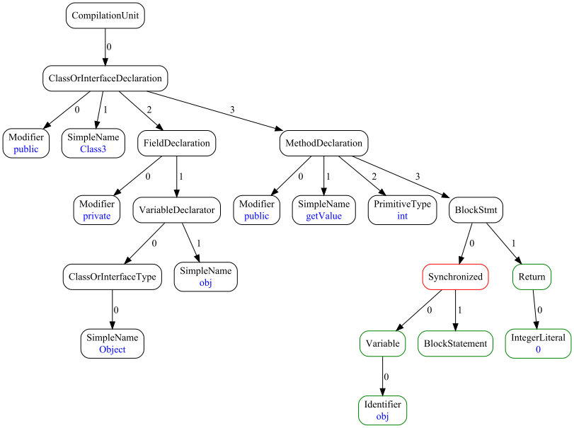

# Abstract Syntax Trees Generator / Converter


[](https://codecov.io/gh/unified-ast/ast-generator)
[](https://github.com/unified-ast/ast-generator/blob/master/LICENSE.txt)
___

## Brief
This software was prepared as part of an investigation of the possibilities of transformation
and unification of syntax trees.

This application is a compiler/interpreter for a domain-specific language ("DSL") that allows
to describe syntax trees and their transformations.

In compiler mode, the application generates source code in the Java programming language,
which describes the structure of a specified syntax tree, methods for subtrees transforming,
as well as auxiliary classes. The generated source code is then used in another project for
predefined syntax tree operations.

In interpreter mode, the application transforms the syntax tree represented in JSON format according
to the specified DSL rules.

## Requirements

* Java 1.8
* Maven 3.8+ (to build)

## Syntax tree representation



## Command line interface

Here and below, it is assumed that the name of the executable file is `generator.jar`.

### Compiler mode

This mode generates Java source files that represent the structure of the specified syntax tree
and methods for processing it. Such sources must be a part of another project that works with syntax trees.
8 types of files are generated:
* files `package-info.java`;

Syntax:

```
java -jar generator.jar --action generate --rules <path to .dsl file> [options]
```