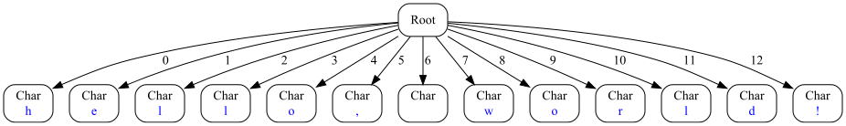

# ASTRANAUT - Abstract Syntax Trees Generator / Converter


[](https://codecov.io/gh/cqfn/astranaut)
[](https://github.com/cqfn/astranaut/blob/master/LICENSE.txt)
___

## 👨‍🚀 Brief

Welcome aboard **Astranaut** — a quirky little Java project with a cosmic name and a singular mission:
to explore, describe, and reshape **syntax trees** (you know, ASTs).

Yes, the name is a pun. It's a mash-up of:
- **AST** — as in _Abstract Syntax Tree_, the skeletal structure of code,
- **transformation** — because we're not just reading trees, we're changing them,
- and **automation** — because doing it all by hand is so last century.

In short, **Astranaut** lets you:
- define and reason about the structure of syntax trees,
- perform pattern-based transformations: find specific nodes (or entire subtrees) and replace them with something 
  smarter, simpler, or just different.

Whether you're building a code linter, refactoring engine, domain-specific transpiler, or just a curious developer
who loves playing with compilers — Astranaut is your friendly toolkit for working with trees like a pro.

## Requirements

* Java 1.8
* Maven 3.6.3+ (to build)

## How to download and build 

You can download the latest release
[here](https://repo.maven.apache.org/maven2/org/cqfn/astranaut).

Fastest way to build the executable is to open the project in Intellij IDEA, select the "Maven" tab
and double-click on the "package" item.

To build using console, go to the folder that contains the project, and type:
```
mvn package
```

In both ways, the executable file named `generator.jar` will be in the `target` folder.

## How It Works

At the heart of Astranaut is a tiny, cozy DSL — a **Domain-Specific Language** for describing the structure of your
syntax trees *and* the rules for transforming them. It’s intentionally simple (because nobody wants to learn
Yet Another Language), but still powerful enough to express real-world transformations.
Or at least, we like to think so.

Astranaut runs in **two distinct modes**, depending on your mood and use case:

### Mode 1: Code Generation

This is the real deal. Astranaut takes your DSL definitions and spits out full-blown Java code:
- 🧱 Classes representing AST nodes.
- 🔁 Transformers that walk and mutate the trees.
- 🛠️ Utility classes to help you wire everything into your Java project with minimal fuss.

Think of it like ANTLR, but focused purely on AST structure and transformation.
If you've ever used tools that generate parser or visitor classes — you're in familiar territory.

### Mode 2: On-the-Fly Interpretation

Too impatient to generate code and compile it? We got you. In interpretation mode, Astranaut:
- loads your DSL definitions,
- parses input (either raw text or a JSON-formatted syntax tree),
- runs the transformation right then and there,
- and gives you back a new JSON tree as output.

Yes, it’s a bit slower than the generated code. But it’s perfect for quick experimentation, debugging,
or just getting a feel for your rules.

Bonus: Astranaut can also draw pretty pictures of your trees — PNG or SVG — which is super handy when you’re trying
to debug a pattern or just admire your beautifully structured code.

## 🌳 Trees, Glorious Trees

At the core of Astranaut lies a clean, minimalistic model for representing syntax trees.
It’s all based around just **three interfaces** — elegant, extensible, and designed with transformation in mind.

Every tree node you’ll ever meet in Astranaut is an implementation of the `Node` interface.
Here’s what you need to know:

### Node — The Backbone of the Forest

Think of this as the universal interface for AST nodes. It’s immutable (on purpose!), thread-safe, and designed to be
friendly for both humans and code generators. With just a few methods to implement, it's easy to extend — but behind
the scenes, it still packs a punch.

Highlights include:
- Access to the node’s **type**, **data**, **properties**, and **children**.
- Methods for **deep comparison**, **cloning**, and even generating string representations.
- A custom `List<Node>` wrapper for children (yay, no more reinventing `.getChild()` loops).
- Utility methods to iterate, stream, and pattern-match your way through the tree.

### Type — What Kind of Node Is This?

Each node has a `Type`, which describes:
- its **name**,
- its **child type constraints** (useful for validation),
- optional **group hierarchy** membership,
- and a handful of helpful **properties**.

It’s like a schema for your tree, but in a form that plays nice with both DSL and Java code.

### Builder — Assemble Your Node

Last but not least, there’s the `Builder` interface. You’ll use this when creating new nodes — whether manually,
or during a transformation. Builders are stateful, chainable, and they validate things for you before you ever
call `createNode()`.

You set:
- the **fragment** (a bit of source code, if you have it),
- the **textual data** (optional),
- the **children** (obviously),
and then, if all is good, voilà — you get a brand-new immutable `Node`.

## JSON Input/Output (Interpreter Mode)

When running in **interpreter mode**, Astranaut doesn’t generate code — instead, it takes a tree (in JSON format),
applies your transformation rules on the fly, and spits out a new JSON tree. It’s perfect for quick prototyping,
testing, and exploring.

Here’s a real-life example of a minimal input tree:

```json
{
  "root": {
    "language": "java",
    "type": "Root",
    "children": [
      {
        "type": "Addition",
        "children": [
          {
            "type": "Addition",
            "children": [
              {
                "type": "Identifier",
                "data": "text"
              },
              {
                "type": "IntegerLiteral",
                "data": "123"
              }
            ]
          },
          {
            "type": "IntegerLiteral",
            "data": "456"
          }
        ]
      }
    ]
  }
}
```

Let’s break it down:
- The tree starts with a Root node — this is your entry point.
- Inside, there's an Addition node with two children:
  - Another nested Addition, combining an identifier ("text") and a number (123).
  - And finally, a second IntegerLiteral with value 456.
This structure might come from parsing an expression like:

```java
text + 123 + 456
```

Oh, and of course, Astranaut’s core library (astranaut-core) comes with full support for reading and writing these
JSON trees. So you can integrate it into your tools, editors, or pipelines effortlessly.

### Where to Find All This

These interfaces (and a bunch of handy utilities) live in the separate Maven module:
[`astranaut-core`](https://github.com/cqfn/astranaut-core) — a lightweight library that provides all the foundational
plumbing for AST modeling and manipulation.

Generated nodes, transformers, and everything your DSL produces will implement these interfaces.
So once you learn this model, you're good to go across the whole platform.

Want to explore the guts? Head to the [core documentation](https://github.com/cqfn/astranaut-core/blob/master/README.md) 
for deep-dives, advanced examples, and a few delightful hacks.

## Command-Line Interface

Astranaut ships with a CLI so you can generate code or run transformations with minimal effort and maximum control.

### Basic Usage

```bash
java -jar generator.jar <action> <path-to-dsl> [options...]
```

Yep, that’s it. Just two required arguments:

1. `<action>` — what you want Astranaut to do (generate, etc.)
2. `<path-to-dsl>` — path to your DSL file (the one that defines the AST structure and transformation rules)

After that, optional flags kick in depending on what you're doing.

### Action: `generate`

This is the bread and butter of Astranaut: turn your DSL into shiny, compile-ready Java code.

```bash
java -jar generator.jar generate my.dsl \
  [--output out/folder] \
  [--license license.txt] \
  [--package com.example.ast] \
  [--version 1.2.3]
```

**Available options:**

| Flag              | Description                                                                                                                                                           |
| ----------------- | --------------------------------------------------------------------------------------------------------------------------------------------------------------------- |
| `--output`, `-o`  | Folder where Java files will be generated. Defaults to `./output`.                                                                                                    |
| `--license`, `-l` | Path to a license (copyright) text file. If provided, its contents will be prepended to all generated files. If not provided, a basic autogenerated one will be used. |
| `--package`, `-p` | Java package name for the generated classes. Default is simply `ast`, but you can (and should!) use something that fits your project.                                 |
| `--version`, `-v` | Version number to embed in the generated classes. Makes version tracking — and passing static analysis — way easier.                                                  |

Why bother with license headers and versioning? Because we’re perfectionists. We want the generated code to pass
every linter, every checker (CodeStyle, PMD, whatever your build throws at it) without needing any exceptions
or suppressions.

Yes, the generated code is clean. Yes, it looks like something you'd proudly write by hand. Yes, you can trust it.
Believe us. Or better yet — try it. 😎

### Action: `transform`

Use this action when you want to apply your DSL-defined transformations directly to a JSON tree.
No codegen, no compilation — just in-place tree magic.

```bash
java -jar generator.jar transform my.dsl \
  --source input.json \
  [--language java] \
  [--ast output.json] \
  [--image tree.svg]
```

**Options:**

| Flag               | Description                                                                                                                                                     |
| ------------------ | --------------------------------------------------------------------------------------------------------------------------------------------------------------- |
| `--source`, `-s`   | Path to the input JSON file (your original syntax tree). **Required.**                                                                                          |
| `--language`, `-l` | Target language name. Defaults to `"common"`. This comes into play if your DSL supports multiple languages (yes, that’s a thing — see "green-red trees" below). |
| `--ast`, `-t`      | Output path for the transformed syntax tree in JSON format. Optional — skip this if you just want to sanity-check your DSL or transformations.                  |
| `--image`, `-i`    | If specified, generates a visual representation of the final tree (after transformation). Just pass the file name, either `.png` or `.svg`, and you’re set.     |

**🎨 Tree Visuals?** Absolutely. Sometimes looking at a transformed AST as JSON is... less than inspiring.
Use --image tree.png or tree.svg to see your result laid out as an actual tree diagram.
It’s great for debugging — and even better for slide decks or documentation.

Here is an image of the tree derived from the JSON example above:


### Action: `parse`

This one’s a bit different — instead of feeding Astranaut a full-blown syntax tree in JSON, you give it plain **text**.
A regular file. Just characters.

Astranaut then:
1. Parses your file **character by character** into a flat "degenerate" AST
   (basically a `Root` node with one child per character).
2. Applies your transformation rules to fold those characters into meaningful nonterminals.
3. Outputs a full, structured AST as JSON — or as an image, if you like pictures.

Here is an example of a degenerated tree before processing:



#### Usage:

```bash
java -jar generator.jar parse my.dsl \
  --source code.txt \
  [--language java] \
  [--ast output.json] \
  [--image tree.png]
```

**Options** (same as `transform`):

| Flag               | Description                                                                                      |
| ------------------ |--------------------------------------------------------------------------------------------------|
| `--source`, `-s`   | A plain-text file to parse. **Required**.                                                        |
| `--language`, `-l` | Target language (from your DSL). Defaults to `"common"`.                                         |
| `--ast`, `-t`      | Output path for the resulting AST in JSON format. Optional.                                      |
| `--image`, `-i`    | Path to an image file (SVG or PNG) that will visualize the final tree. Optional, but super cool. |

This is your go-to action when you want to define your own parser using transformation rules alone.

## The DSL Syntax

Ah yes, the **DSL** — the tiny language you write to define your trees and how they evolve.

We’ve kept the syntax intentionally minimal and — dare we say — _pleasant_. You can probably guess what things do just
by reading them. No weird symbols, no cryptic meta-rules. Just clean, declarative structure.

### Basic Structure

A DSL file is simply a list of **rules**, and each rule ends with a **semicolon** (`;`).

That’s it. That’s the one rule to remember.

Newlines? Totally optional. You can:
- write **long rules** across multiple lines (for readability),
- or cram **multiple short rules** into a single line (for compactness).

Whichever makes it easier to read — do that. Astranaut doesn’t judge.

Here’s an example of both styles:

```dsl
Addition <- Expression, Expression;

Expression#1, [Whitespace], Operator<'+'>, [Whitespace], Expression#2 
->
Addition(#1, #2);
```

### Comments are totally a thing

Like any decent language, the Astranaut DSL lets you sprinkle in **comments** — because future-you (or your teammates)
will thank you.

We support good old **C-style comments**, in both formats:

#### Single-line comments

Use `//` to comment from that point to the end of the line:

```dsl
// This rule declares an 'Addition' node that has two children:
Addition <- Expression, Expression;
```

#### Multi-line comments

Use `/* ... */` to comment across multiple lines — or inline, if you're feeling fancy:

```dsl
/*
   This rule declares a conversion to a node of type 'Addition',
   by consuming a minimum of three and a maximum of five nodes:
*/
Expression#1 /* required */, [Whitespace] /* optional */, Operator<'+'>, [Whitespace], Expression#2 
->
Addition(#1, #2);
```

Comments are completely ignored during parsing, so feel free to get as wordy (or poetic) as you like.

### Languages & Green-Red Trees

During development of the larger project that Astranaut was originally built for, we ran into an interesting challenge:
**some rules are universal**, while others are **language-specific**.

Take this rule, for instance:

```dsl
Addition <- Expression, Expression;
```

This makes sense for pretty much any programming language — C, Java, Python, you name it.
Addition is universal: it takes two operands, both are expressions. No surprises there.

But then consider something like:

```dsl
Synchronized <- Expression, StatementBlock;
```

Yeah... that’s very Java. C doesn't have it. Python certainly doesn’t.

To handle this, we introduced a **simple language tagging mechanism**:
Just write a language name followed by a colon. Like this:

```dsl
// General rules for any language
Addition <- Expression, Expression;

// --- Language-specific section ---
java:

// Java-only constructs
Synchronized <- Expression, StatementBlock;
```

**`common` is the default**

By default, all rules go into the "common" bucket — that is, they apply to all languages unless you specify otherwise.
So if you’re writing a simple DSL with no language variations, you can forget this feature even exists.

But if you’re building a cross-language DSL, just toggle between languages with lines like:

```dsl
common:
python:
java:
```
You can switch back and forth as needed.
**Language names are case-insensitive** and are always lowercased internally.

#### Green-Red Trees (Yes, seriously)

Here's where it gets fun. Every generated node in Astranaut includes a few built-in properties:

- `language` — the name of the language the rule belongs to.
- `color` — a visual tag used when drawing trees.

If a node comes from a `common` rule, it gets marked:
```json
{"color": "green"}
```
If it comes from a language-specific rule, like `java`:, it’s marked:
```json
{"color": "red"}
```
When visualizing your trees (e.g. with --image), this gives you a green-red tree:
- Most of it will be green, representing universal structure.
- The red parts are language-specific nuances.


Why does this matter? Because:

- Green trees are portable. You can write generic algorithms that work across all languages.
- Red trees are fragile. You often need to handle them case-by-case.

So we aim for maximum greenery — and when we can’t avoid red, we write "greening" transformations that convert
red nodes into green subtrees with equivalent meaning.

We found this model delightful. It made our tooling more robust, our trees more beautiful, and our team just a
little bit happier. We hope it sparks the same joy for you.

### Two Types of Rules — Structure vs. Transformation

The Astranaut DSL has just **two kinds of rules**, and they're both dead simple.

Each rule has:
- a **left-hand side**,
- a **right-hand side**,
- and a **separator** in between that tells us what kind of rule we're dealing with.

Let’s break it down:

#### Structure Rules: `<-`

These describe what a node **should look like**.

Example:

```dsl
Addition <- Expression, Expression;
```

This defines a node called Addition that always has exactly two children, both of type Expression.

What does this rule do?

- In code generation mode, it causes Astranaut to generate:
  - a `Node` implementation (Addition),
  - a corresponding `Type`,
  - and a `Builder` class.
- In interpreter mode, it just registers the expected shape of this node for later use in transformations.

💡 And here’s the really important part:

> Nodes are only ever created if their structure is valid.  
  So **if a node exists** — you can trust that **it’s syntactically correct**.

Since the **root** of a tree is also a node, this means: 

> **If a root exists, the whole tree is valid**.

#### Transformation Rules: `->`

These describe how to convert one tree pattern into another.

Example:

```dsl
Expression#1, [Whitespace], Operator<'+'>, [Whitespace], Expression#2
    -> Addition(#1, #2);
```

Here’s what happens:
- The left-hand side defines a **pattern** to match in the tree.
- The right-hand side defines **how to replace it** — in this case, with an `Addition` node.

This rule will:
- generate Java code that performs this transformation (if you're using `generate`),
- or apply the transformation on-the-fly (if you're using `transform` or `parse`).

One important thing:

> The node on the right-hand side must be previously defined with a **structure rule** (`<-`).  
  Otherwise, you’ll get a compile-time error in the DSL.

This separation between structure and behavior keeps things clean and modular:

- You define what nodes are.
- You define how they evolve.

Everything else flows from there.

### Defining Nodes

You’ve already seen this one a few times — let’s give it the spotlight it deserves:

```dsl
Addition <- Expression, Expression;
```

This is a **structure rule**. You’re telling Astranaut: "Please define a node named `Addition`,
which always has two children, both of type `Expression`".

#### Left-hand side: the node name

The thing on the left of `<-` is the node type name — just a single identifier. A few important notes:

- It must be **unique** within the DSL file.
- It’s case-sensitive.
- **Some names are reserved**, and using them will throw an error:

```
Char, Insert, Replace, Delete, Object, List, Map, Set, Arrays
```

Why? Because:

- Some of these are **Java standard classes** (`List`, `Map`, `Set`, etc.),
- Others are **used internally** in `astranaut-core` (like `Insert`, `Replace`, etc.),
- And all of them are just asking for trouble if reused.

Play it safe — use domain-specific names that reflect the actual intent of your tree structures.

####  Right-hand side: node descriptor list

The part to the right of `<-` is a **comma-separated list of descriptors** — one for each child node.
In our example:
- The node `Addition` **must** have **two children**.
- Both **must** be nodes of type `Expression`.

This is the most common and straightforward case.  
There are more advanced descriptors (e.g., optional nodes, repeated nodes, constraints),
and we’ll get to those soon — but at its core, this is how you define what a node should contain.

Simple, declarative, powerful.

### Nodes Without Children

Sometimes a node has **no children at all**. This might sound odd at first, but it’s quite common — especially for
things like literals, keywords, or constants.

Example:

```dsl
This <- 0;
```

This defines a node called `This` that has exactly zero children. In Java, the `this` keyword is a self-reference —
a special kind of expression with no internal structure. This rule captures that perfectly.

### Optional Children: `[...]`

Sometimes a node can have **optional children** — fields that may or may not be present, depending on the context.

In Astranaut DSL, optional children are wrapped in **square brackets**:

```dsl
VariableDeclaration <- [TypeName], Identifier, [Expression];
```

This defines a VariableDeclaration node with up to three children:

1. An optional `TypeName`,
2. a required `Identifier`,
3. and an optional `Expression`.

So the following are all valid:

- `int x = 42;` → all three children present,
- `x = 42`; → no type name,
- `int x;` → no initializer.

The order of descriptors defines structure, but not always how transformation rules must match or build them —
and that’s where things get interesting.

### ⚠️ A Word on Child Matching During Transformations

When a transformation rule fires, Astranaut tries to build a new node based on its structure
(as defined via a <- rule).

Here’s how it works:
- If the node has **multiple children of the same type**, the **order matters** in the transformation rule. 
  For example, mixing up two `Expression`s may flip your operands — and that would be bad.
- But if the node’s children are of **different types**, Astranaut can match them **positionally or by type**,
  as needed. It will "slot" each matched child into the right place — smartly and safely.

This makes rule-writing easier and less error-prone — especially for cases with optional or heterogeneous children.

Don’t worry — we’ll go deeper into how this matching works when we talk about transformation rule syntax.
It’s both intuitive and powerful. Stay tuned!

### Tags for Child Nodes

Let’s revisit a couple of earlier examples, but this time — with a little twist:

```dsl
Addition <- left@Expression, right@Expression;
VariableDeclaration <- [className@TypeName], name@Identifier, [initial@Expression];
```

That `name@Identifier` syntax? It’s called a tag, and it’s awesome.

**So, what are tags?**  
Tags let you **name** each child in a structure rule. This does two things:

- **Improves DSL readability** — it’s way easier to tell what each part is.
- **Enhances generated Java code** — each tagged child becomes a named getter.

Example:

```java
Identifier varName = varDecl.getName();  // thanks to name@Identifier
```

Without the tag, you'd be stuck with something like:

```java
Identifier varName = (Identifier) varDecl.getChild(1);  // ouch.
```

Rules for tagging:
- Tags must be valid Java identifiers.
- Tags are optional — but highly recommended.
- ❌ Tags must be unique within a single node.  
  You can’t have two children with the same tag — the DSL compiler will throw an error.

Tags are especially helpful when your node has multiple children of the same type —
like two `Expression`s in an `Addition`. The tag helps prevent confusion and improves both safety and clarity.

In short: if you care about naming things (and you should), tag your children.

### Repeated Children — `{...}`

Sometimes a node needs to hold a **flexible number of children** — like a list of arguments, statements, or elements.

In Astranaut DSL, this is done with **curly braces**:

```dsl
ArgumentsList <- {Expression};
```

This defines an `ArgumentsList` node that can have zero or more `Expression` children — all of the same type.
Think of it like `List<Expression>` — only in tree form.

Key rules for repeated children:
- The curly braces mean "**repeating**" — you’re saying: "this child may occur 0, 1, 2... N times."
- Only **one repeated child is allowed per node** . You can’t have `{A}, {B}` in the same rule.
- Repeated children must all be of the same type — no mixing.


## Contributors

* Ivan Kniazkov, @kniazkov
* Polina Volkhontseva, @pollyvolk

See our [Contributing policy](CONTRIBUTING.md).