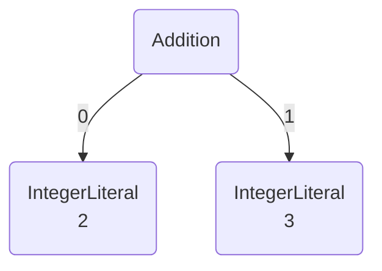
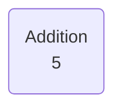
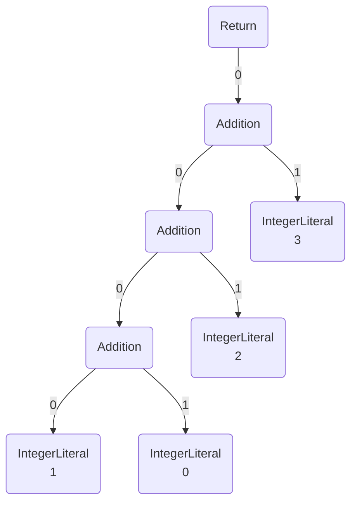
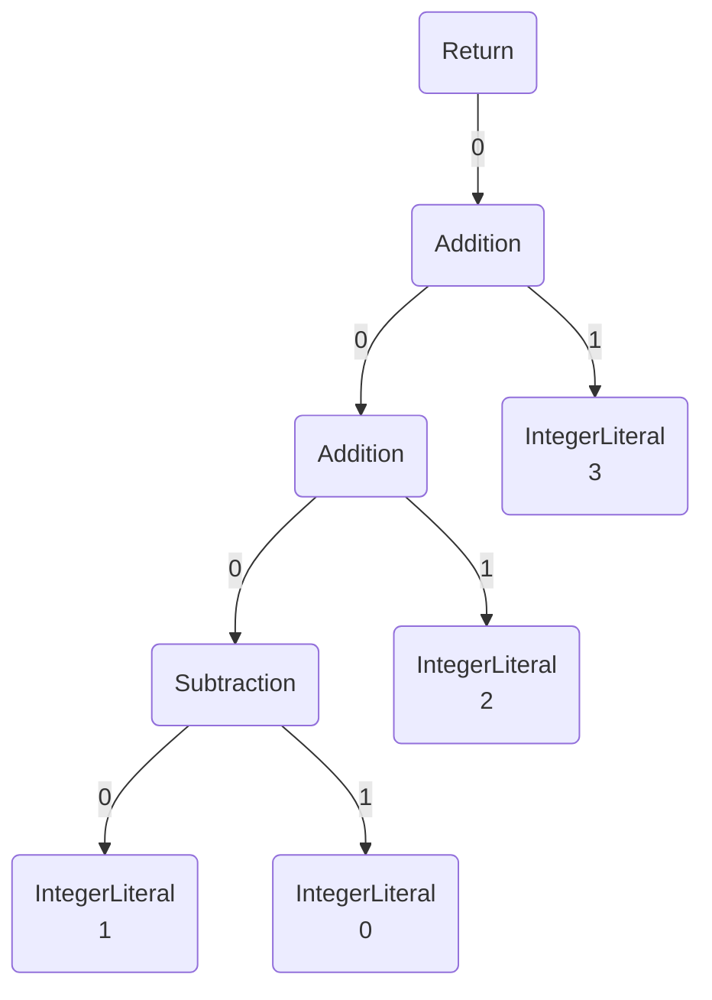

Astranaut API
---

## About

Astranaut API provides an ability to access Astranaut as a library.

> For now API is available for Java language.

## Usage

Add Astranaut library to your project using a Maven or a Gradle dependency.

**Example:**

Maven:
~~~xml
<dependency>
    <groupId>org.cqfn</groupId>
    <artifactId>astranaut</artifactId>
    <version>0.2.1</version>
</dependency>
~~~

Gradle:
~~~
implementation 'org.cqfn:astranaut:0.2.1'
~~~

You can find project versions in [Maven Central Repository Search](https://search.maven.org/artifact/org.cqfn/astranaut).

With Astranaut API you can:

- [transform](#transform) - modify a tree using rules written in [DSL](https://github.com/cqfn/astranaut/blob/master/src/main/documents/bnf.md);
- [serialize](#serialize) - convert a tree to a `JSON` object and save in a file;
- [deserialize](#deserialize) - load a tree from a `JSON` string;
- [visualize](#visualize) - save a tree in a graphical format.

## Transform

To transform a tree you have to represent a tree with classes that implement the `Node` interface.

There is a class with a basic implementation of `Node` called `DraftNode`, 
which you can use if it is not possible to implement `Node`.

To convert the tree you have to create a `txt` file or compose a string with transformation rules 
and apply them to an initial tree using `TreeProcessor`.

The `TreeProcessor` has the following methods:

1. `boolean loadRules(String filename)` - to load transformation rules from a file.
2. `boolean loadRulesFromString(String code)` - to load transformation rules from a given string.  
3. `Node transform(Node tree)` - to transform an input tree using loaded rules.
4. `int countRules()` - to get an amount of loaded rules.
5. `int calculateVariants(int index, Node tree)` - to get an amount of possible tree transformations that may be
    done by applying a specified rule.
6. `Node partialTransform(int index, int variant, Node tree)` - to apply a chosen variant of transformation to 
   an input tree using a specified rule.

**Example:**

#### Transformation

You can create a simple tree:



in the following way:

~~~java
final DraftNode.Constructor addition = new DraftNode.Constructor();
addition.setName("Addition");
final DraftNode.Constructor left = new DraftNode.Constructor();
left.setName("IntegerLiteral");
left.setData("2");
final DraftNode.Constructor right = new DraftNode.Constructor();
right.setName("IntegerLiteral");
right.setData("3");
addition.setChildrenList(Arrays.asList(left.createNode(), right.createNode()));
final Node tree = addition.createNode();
~~~

For this example, let us transform the tree to the only one node `IntegerLiteral` with a sum of two integers:



To do so, create a file (here, `rules.txt`) with the rule

~~~
Addition(IntegerLiteral<"2">, IntegerLiteral<"3">) -> IntegerLiteral<"5"> ;
~~~

After that, apply the rule:

~~~java
final TreeProcessor processor = new TreeProcessor();
processor.loadRules("rules.txt");
final Node result = processor.transform(tree);
~~~

#### Partial transformation

Consider the case when an initial tree has several subtrees with same features.

For example, the following tree has three additional expressions:



Suppose, you want to apply the rule `Addition(#1, #2) -> Subtraction(#1, #2);` only to the first (the left one) expression.

To do so, pass your rules to the processor. Then specify the exact rule you want to apply, the index of the transformation
variant and the tree to be modified:

~~~java
final TreeProcessor processor = new TreeProcessor();
processor.loadRulesFromString("Addition(#1, #2) -> Subtraction(#1, #2);");
final Node result = processor.partialTransform(0, 0, tree);
~~~

For this example, result will be:


To calculate an amount of possible variants of the rule application:

```java
final int amount = processor.calculateVariants(0, tree);
```

## Serialize

To serialize a tree to a `JSON` create an object of `JsonSerializer` with a tree as an argument:

~~~java
final JsonSerializer serializer = new JsonSerializer(tree);
~~~

To convert a tree to a string with a `JSON` object use:

~~~java
final String json = serializer.serializeToJsonString();
~~~

To save an object in a file use the following method with a file name:

~~~java
serializer.serializeToJsonFile("Data/tree.json");
~~~

## Deserialize

To deserialize a `JSON` object to a tree create an object of `JsonDeserializer` 
with a string that contains a `JSON` object as an argument. \
After that, use the `deserialize` method:

~~~java
final String obj = "" +
        "{\n" +
        "  \"root\": {\n" +
        "    \"type\": \"ReturnStatement\",\n" +
        "    \"children\": [\n" +
        "      {\n" +
        "        \"type\": \"IntegerLiteral\",\n" +
        "        \"data\": \"11\"\n" +
        "      }\n" +
        "    ]\n" +
        "  }\n" +
        "}";
final JsonDeserializer deserializer = new JsonDeserializer(obj);
final Node tree = deserializer.deserialize();
~~~

## Visualize

To visualize a tree create an object of `TreeVisualizer` with a tree as an argument.\
Further, use the `visualize` method with a file name as an argument:

~~~java
final TreeVisualizer visualizer = new TreeVisualizer(tree);
visualizer.visualize(new File("Data/tree_img.png"));
~~~

> Image file extension can be `.png` or `.svg`

---

See source code with usage examples [here](https://github.com/cqfn/astranaut/tree/master/src/it).